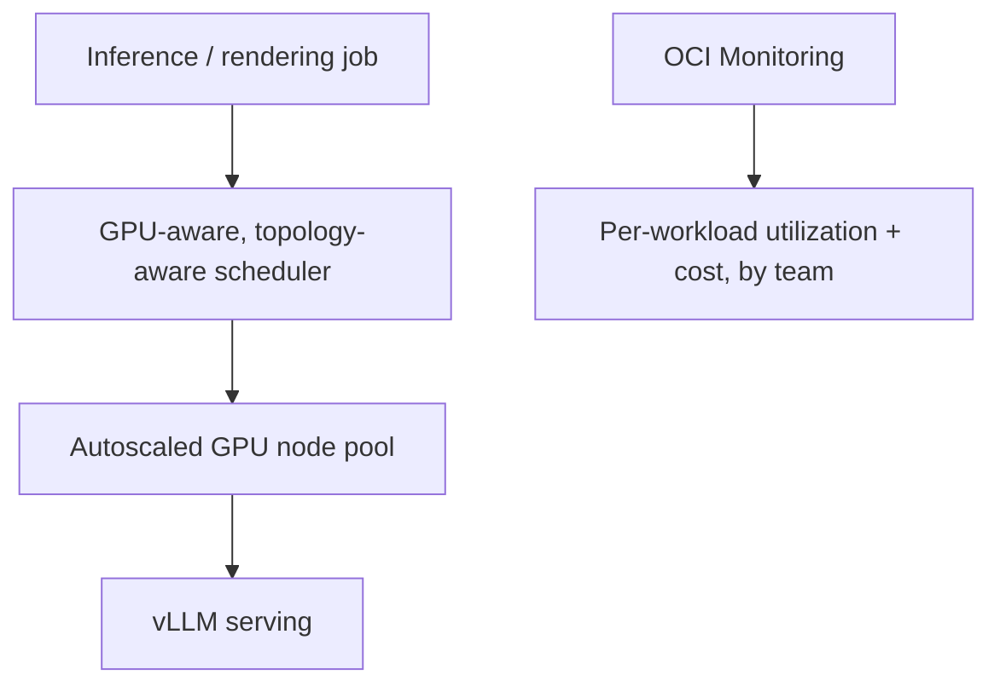

# Making an expensive GPU bill somebody's accountability, not a shared mystery

**OneCloud — Cloud & DevOps Engineer, 2025**

## The problem nobody had explicitly asked me to solve

I built and ran an autoscaled, multi-node NVIDIA GPU fleet on OCI for rendering, simulation, and
large-model inference. The brief was, roughly, "make this scale and perform." What I noticed once
I was in it was a second problem nobody had framed as a project requirement: GPU capacity is the
line item everyone on the finance side notices and almost nobody on the engineering side can
explain in a way that survives a follow-up question. I decided that was worth fixing alongside the
performance work, not after it.

## Where the real engineering time went

Autoscaling a GPU node pool sounds like a solved problem until you internalize that idle GPU
capacity is the single most expensive kind of idle capacity a cloud bill has — so the scaling
policy (`scripts/gpu-nodepool-autoscaling.yaml`) only scales out when GPU-requesting work is
actually queued, and scales back in aggressively the moment it isn't. vLLM handled large-model
inference serving on top of that scheduling layer.

The part I spent more time on than I initially budgeted for was topology. A multi-node inference
job spread across GPUs with a poor interconnect path runs *worse* than the same job placed on
fewer, correctly-adjacent GPUs — I confirmed this the expensive way, by benchmarking a job that
technically had "enough" GPUs assigned to it and watching it underperform a smaller, better-placed
allocation. That single result reframed the entire scaling conversation on this project, from
"we need more GPUs" to "we need to place the ones we have correctly first" — which is both a
cheaper and a better answer in most real cases, and not the answer most scaling conversations
default to.

## The dashboard that changed behavior, not just visibility

`scripts/gpu-cost-dashboard.json` is the OCI Monitoring setup that turned "the GPU bill" from one
shared, unowned number into per-team, per-workload attribution. This did more for how the platform
was actually perceived internally than any amount of scheduler tuning — once a team could see
their own number next to their own workload, GPU usage stopped being everyone's shared problem and
started being something individual teams optimized on their own initiative, without me having to
chase anyone about it.

## The environment this ran inside

All of it operated within an ISO 27001 / PCI DSS certified facility — a constraint the platform was
built to operate correctly within, not something I personally implemented, but worth stating
plainly because it's exactly the kind of detail someone evaluating where their workloads actually
run will ask about.

## Net result

An autoscaled, multi-node GPU fleet running real inference and rendering workloads, with
per-workload cost attribution that turned the spend from "large and unexplained" into "large and
defensible" — which, for infrastructure this expensive, is most of what a finance stakeholder
actually needs to hear.
