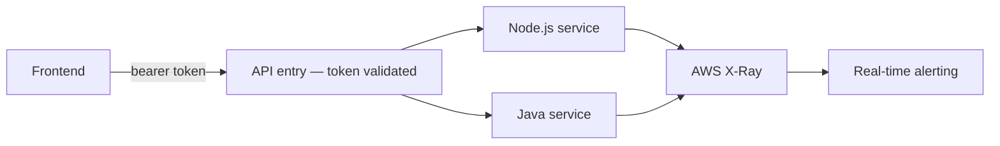

# The security work nobody notices until it's missing

**OLLMOO — London, UK (remote) — Software Engineer & DevOps Specialist, 2022–2024**
*(the platform this secures: [`09-cloud-native-saas-platform`](../09-cloud-native-saas-platform))*

Infrastructure security gets a project name and a diagram. Application security is usually just
"the middleware," which is a shame, because it's where most of the actual risk lives on a product
like this one — three languages, three service boundaries, and every one of them needing the same
answer to "is this caller allowed to do this."

## What I put in the shared path, not in each developer's memory

OAuth 2.0 and OIDC validate every request at the API entry point (`scripts/auth-middleware.js`), so
no individual service reimplements its own auth check slightly differently from the others. Role
checks happen per service, because a valid token proves who you are, not what you're allowed to do
— those are different questions and I wanted the code to treat them that way. Input validation,
output encoding against XSS, and CSRF protection on anything that changes state live in shared
middleware, not as something a feature developer has to remember to add on a Friday afternoon
under a deadline. That last part is the actual decision worth mentioning: the defenses that get
skipped under delivery pressure are exactly the ones I made structurally hard to skip.

## The tracing half of this

Three services means "why did this request fail" used to mean opening three separate logs and
guessing at the timeline. AWS X-Ray (`scripts/tracing-config.js`) turned that into one trace per
request. That's the whole reason MTTR dropped **60%** — not a smarter on-call engineer, just less
time spent reconstructing what happened before anyone could start actually fixing it.

## The honest version of "why this matters"

Nobody thanks you for the CSRF token that quietly worked. This kind of work is invisible when it's
done right, which is exactly why it's easy to underinvest in on a small team moving fast — and
exactly why I made sure it lived in the framework, not in anyone's discipline.
