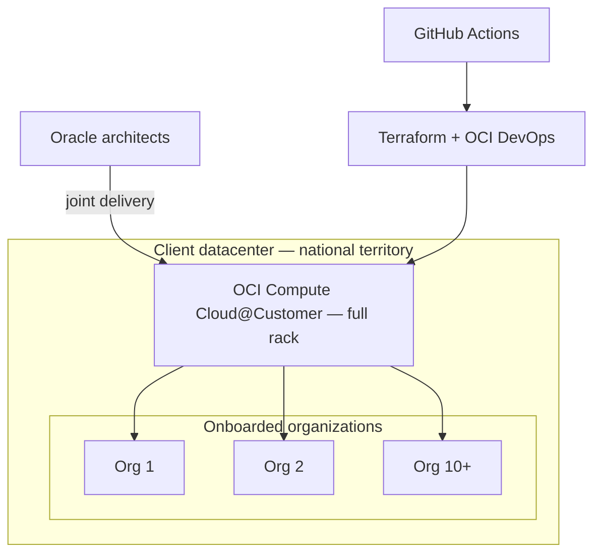

# Morocco's First OCI Compute Cloud@Customer Deployment

**Employer:** OneCloud — Cloud & DevOps Engineer · **Timeframe:** 2025 · **Role:** Delivered
alongside Oracle's own architects · **Client:** withheld under NDA (multi-tenant platform, 10+
organizations onboarded)

## Summary

The country's first full-rack Oracle Compute Cloud@Customer (C3) installation — a
fully-managed OCI region running inside the client's own datacenter, for workloads that legally
could not leave national territory.

## The challenge

Some workloads have a hard data-residency constraint: the data cannot leave the country, full
stop. Public-region cloud isn't an option, but the client still needed OCI's actual managed
service experience — not a bespoke private-cloud build that would drift from Oracle's supported
platform over time.

## Architecture

## Implementation

- **Joint delivery with Oracle**: the physical rack install and initial platform bring-up were
  done alongside Oracle's own architects — this was a first-of-its-kind deployment in the
  country, not a repeatable playbook Oracle already had for this market.
- **Infrastructure as code from day one**: Terraform (`scripts/c3-tenancy.tf`) and OCI DevOps
  managed tenant provisioning so onboarding the 10+ organizations that followed the initial
  deployment was a repeatable, reviewed process rather than manual console work per tenant.
- **CI-driven provisioning**: a GitHub Actions pipeline (`scripts/tenant-onboarding.yml`) turned
  "onboard a new organization" into a pull request with a Terraform plan attached, not a support
  ticket.

## Security

Data residency was the entire point of the engagement — every workload on the platform stayed on
national territory by construction (the hardware itself never left the client's datacenter), not
by a data-handling policy layered on top of infrastructure that could technically reach outside it.

## Outcomes

- **1st** OCI Compute Cloud@Customer (C3) deployment in the country
- **10+** organizations onboarded onto the shared platform
- **100%** data residency maintained — the constraint the whole project existed to satisfy

## Lessons

Being first meant there was no local precedent to lean on for the physical/logical bring-up —
the most valuable part of working directly alongside Oracle's architects was capturing the
runbook for that bring-up, since every organization onboarded afterward benefited from a
process the first deployment had to build from scratch.

## Tech stack

OCI Compute Cloud@Customer, Terraform, Ansible, OCI DevOps, GitHub Actions

## Related

- [`08-gpu-inference-infrastructure`](../08-gpu-inference-infrastructure) — another OneCloud OCI engagement, compute-focused rather than residency-focused
- [`05-multicloud-banking-migration`](../05-multicloud-banking-migration) — a different OneCloud engagement, same employer and period
