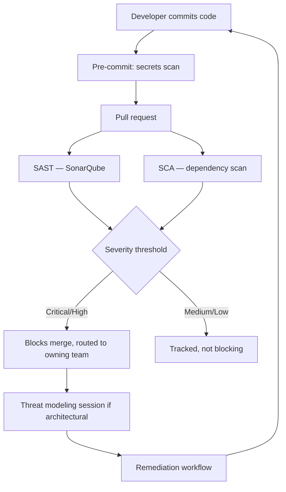

# DevSecOps Shift-Left Security Program

**Employer:** Onclusive — Senior DevSecOps Engineer · **Timeframe:** 2026 · **Role:** Program
owner, worked directly with development teams · **Client:** withheld under NDA

> Re-cut of the same platform in [`01-enterprise-cicd-platform`](../01-enterprise-cicd-platform),
> viewed through the security-culture and process lens rather than the pipeline-engineering lens.

## Summary

Moving security left meant more than adding scanners to a pipeline — it meant giving development
teams the guidance, tooling, and workflow to act on findings themselves, rather than routing
everything through a security team as a bottleneck.

## The challenge

Security findings were being generated (by SAST/SCA/secrets scanners) faster than teams could
triage them without guidance. A scanner that produces noise nobody acts on is worse than no
scanner — it trains people to ignore the tool.

## Architecture

## Implementation

- **Secrets scanning at commit time**, not just in CI — a pre-commit hook (`scripts/pre-commit-config.yaml`)
  catches accidental credential commits before they ever reach a shared branch.
- **Secure coding guidance** delivered as concrete, language-specific checklists tied to the
  SAST rule categories actually firing, not a generic security-policy document nobody reads.
- **Threat modeling** for architecturally significant changes (new service boundaries, new
  external integrations) — lightweight, using a structured template
  (`scripts/threat-model-template.md`) rather than a heavyweight formal process.
- **Cross-functional remediation workflow**: findings above a severity threshold auto-create a
  tracked issue assigned to the owning team with a service-level agreement, not a shared
  security-team backlog.

## Security

This program is the process layer on top of the technical gates described in
[`01-enterprise-cicd-platform`](../01-enterprise-cicd-platform) — the gates enforce the policy,
this program is what makes the policy something teams can actually act on.

## Outcomes

- **+60%** deployment frequency maintained *while* enforcing security policy at every stage —
  the point of shift-left is that security stopped being a tax on velocity
- **−45%** production incidents (shared outcome with the CI/CD platform work, since the two are
  the same underlying effort)
- Findings triaged and remediated by owning teams directly, rather than queued through a central
  security backlog

## Lessons

The threshold-based routing (block on Critical/High, track-not-block on Medium/Low) mattered more
than any individual tool choice — a program that blocks on every finding regardless of severity
teaches teams to find workarounds, not to fix the actual risk.

## Tech stack

SonarQube, Trivy (SCA/secrets), HashiCorp Vault, OPA Gatekeeper, MITRE ATT&CK (threat-modeling
reference), CIS Benchmarks, NIST, ISO 27001/27005 (fundamentals)

## Related

- [`01-enterprise-cicd-platform`](../01-enterprise-cicd-platform) — the pipeline this program's gates run inside
- [`03-kubernetes-workload-hardening`](../03-kubernetes-workload-hardening) — the runtime-security counterpart
