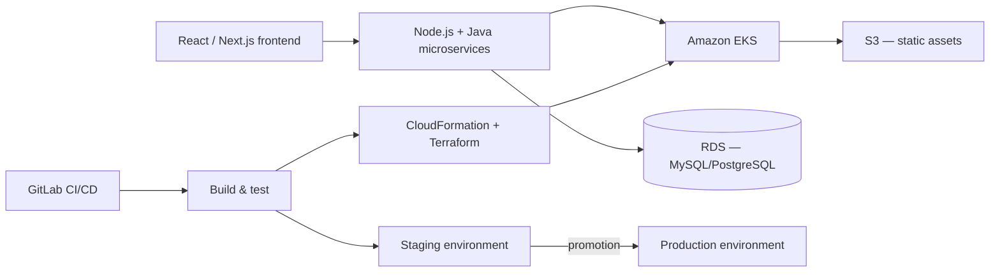

# Cloud-Native SaaS Platform Engineering

**Employer:** OLLMOO (London, UK — remote) — Software Engineer & DevOps Specialist ·
**Timeframe:** 2022–2024 · **Role:** Full-stack development + CI/CD/infrastructure delivery ·
**Client:** product team, withheld under NDA

> Re-cut through an application-security/observability lens in
> [`10-appsec-observability-saas`](../10-appsec-observability-saas).

## Summary

A cloud-native SaaS application — React front end, Node.js and Java microservices — running
containerized on Amazon EKS, with the CI/CD and infrastructure-lifecycle automation to ship it
reliably from a London-based product team working remotely.

## The challenge

The product team needed both feature velocity (a full-stack product still under active
development) and delivery discipline (infrastructure automation, tested deploys) from the same
small engineering effort — no separate platform team to hand infrastructure work off to.

## Architecture

## Implementation

- **Full-stack development**: React/Next.js front end talking to Node.js and Java
  microservices — one engineer covering both the application and the platform it runs on, which
  is why the pipeline work in this project reads differently from the larger dedicated-platform
  efforts in earlier projects.
- **Containerized workloads on EKS**: application services run as containers orchestrated by
  Kubernetes rather than directly on EC2, so scaling and rolling deploys are the cluster's job,
  not a manual runbook.
- **Infrastructure lifecycle as code**: CloudFormation and Terraform together
  (`scripts/eks-cluster.tf`) manage the EKS cluster and supporting AWS resources (EC2, S3, RDS),
  supporting seamless promotion from staging to production rather than hand-built environments
  that drift apart.
- **CI/CD with GitLab**: pipelines (`scripts/gitlab-ci.yml`) build, test, and deploy — automated
  testing workflows introduced from scratch on a codebase that didn't have them before.

## Security

AWS infrastructure, databases, and Salesforce integrations were managed with scalability and
security as an explicit focus, not an afterthought — see
[`10-appsec-observability-saas`](../10-appsec-observability-saas) for the application-layer
security work (auth/authz, input validation) done on the same platform.

## Outcomes

- **+25%** application performance improvement from system restructuring and optimization
- Automated testing and CI/CD workflows introduced where none existed before
- Seamless multi-environment promotion (staging → production) via infrastructure-as-code

## Lessons

Doing both product development and platform work with one person meant the infrastructure had to
stay simple enough to maintain alongside active feature work — CloudFormation for the AWS
primitives Terraform didn't yet manage well at the time, rather than forcing everything through
one tool for its own sake, was a pragmatic call that paid off in maintenance time.

## Tech stack

React, Next.js, Node.js, Java, AWS (EKS, EC2, S3, RDS, Lambda), Docker, Terraform,
CloudFormation, GitLab CI/CD

## Related

- [`10-appsec-observability-saas`](../10-appsec-observability-saas) — the security and observability layer on this same platform
