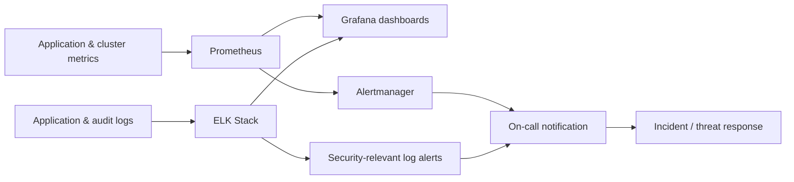

# Security Observability & Monitoring Stack

**Employer:** Onclusive — Senior DevSecOps Engineer · **Timeframe:** 2026 · **Role:** Sole
observability engineer · **Client:** withheld under NDA

> Re-cut of the platform in [`01-enterprise-cicd-platform`](../01-enterprise-cicd-platform),
> focused on what happens after deployment — detection, not delivery.

## Summary

A monitoring, logging, and security-observability stack built to catch problems — both
operational and security-relevant — before they become incidents, not just to have dashboards
that look good after the fact.

## The challenge

Gates at build time and admission time (see
[`02-devsecops-shift-left`](../02-devsecops-shift-left) and
[`03-kubernetes-workload-hardening`](../03-kubernetes-workload-hardening)) can't catch everything —
some problems only show up at runtime: a workload behaving anomalously, a spike in failed auth
attempts, a slow memory leak heading toward an outage.

## Architecture

## Implementation

- **Metrics**: Prometheus scrapes application and cluster metrics; alerting rules
  (`scripts/prometheus-alerts.yaml`) cover both operational thresholds (error rate, latency,
  saturation) and security-relevant signals (abnormal auth failure rate, unexpected outbound
  connections).
- **Logs**: the ELK Stack centralizes application and Kubernetes audit logs, with a log-shipping
  configuration (`scripts/filebeat.yaml`) that tags security-relevant log sources (auth events,
  admission-controller denials, network-policy drops) for separate alerting.
- **Dashboards**: Grafana gives a single view across both metrics and logs, so an on-call
  engineer isn't switching tools mid-incident.

## Security

Correlating Kubernetes audit logs, admission-controller denials (from
[`03-kubernetes-workload-hardening`](../03-kubernetes-workload-hardening)), and application auth
logs in one place turned "did something just get blocked, and was that expected" from a
multi-tool investigation into a single dashboard query.

## Outcomes

- **99.9%** platform uptime maintained
- Proactive threat and incident detection — the resume-stated goal of this stack, achieved by
  correlating security-relevant signals across metrics and logs rather than treating them as
  separate concerns

## Lessons

The security-relevant alerts were noisy at first for the same reason the SAST/SCA findings were
in [`02-devsecops-shift-left`](../02-devsecops-shift-left) — an alert nobody trusts gets muted.
Tuning thresholds against a few weeks of real baseline traffic before turning on paging mattered
more than getting the rule logic perfect on day one.

## Tech stack

Prometheus, Grafana, ELK Stack (Elasticsearch, Logstash, Kibana), Alertmanager

## Related

- [`03-kubernetes-workload-hardening`](../03-kubernetes-workload-hardening) — source of the admission/network-policy events this stack correlates
- [`06-zero-trust-financial-workloads`](../06-zero-trust-financial-workloads) — a similar observability approach applied to a different, regulated environment
