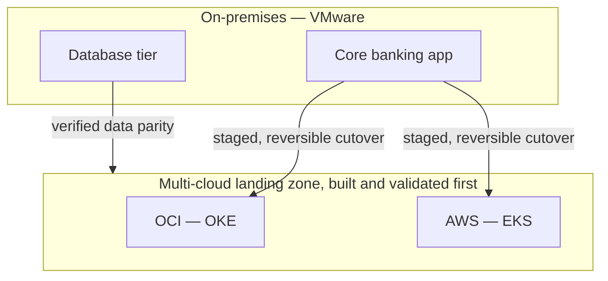

# Moving a live bank off VMware without a single unplanned outage

**OneCloud — Cloud & DevOps Engineer, 2024–2025**
*(security architecture of this migration: [`06-zero-trust-financial-workloads`](../06-zero-trust-financial-workloads))*

## What made this different from a normal migration

I led the migration of core banking applications — 500K+ daily transactions running through
them — off an on-premises VMware estate onto a multi-cloud architecture across OCI and AWS. In
most industries, a rough week during a migration is an inconvenience you apologize for. In
banking, an outage during a cutover is a regulatory event with a paper trail that lands on a
compliance officer's desk, not just an engineering post-mortem. That single fact shaped almost
every decision on this project more than any specific technology choice did.

## Building the destination before touching the source

The sequencing decision I made early, and held to throughout, was: nothing moves until the
destination exists and is validated. I defined the landing zones — network topology, IAM
boundaries, compute footprint — in Terraform (`scripts/landing-zone.tf`) on both OCI and AWS, and
stood the whole thing up before a single production workload was scheduled to move. That meant
weeks of work that produced nothing visibly "in production" yet, which is an uncomfortable place
to be when stakeholders want to see migration progress — but standing up an unvalidated
destination and discovering problems mid-cutover is a much worse place to be.

Ansible (`scripts/compliance-baseline.yml`) applied one compliance baseline consistently across
every provisioned instance. This mattered more than it sounds like it should: the on-premises
estate had years of accumulated configuration drift — one-off fixes applied under pressure,
servers that were "special" for reasons nobody still at the company remembered. Automating the
baseline wasn't just about the new infrastructure being correct. It was about deliberately not
inheriting that history into the new environment.

## Why the cutover was staged, and what that actually bought

A single big-bang cutover is faster on paper. I ran this one as a series of staged, reversible
traffic shifts instead, each with a defined rollback path back to the previous stage — not back to
"start the whole migration over," back one stage. That granularity cost real planning time up
front: every stage boundary needed its own verification criteria and its own rollback runbook, not
just one runbook for the whole project. On a system where 500K+ daily transactions and a
regulator's attention are both real at the same time, I'd make that trade every time — the ability
to pause and roll back one stage rather than the entire migration is worth more than the days it
cost to design.

## The part that's easy to underestimate: data residency and compliance held throughout

This wasn't a lift-and-shift with a compliance checklist attached at the end. Data residency and
the platform's compliance posture had to hold at every intermediate stage of the migration, not
just at the finished destination — which is the actual reason this gets its own write-up instead
of folding into a generic "we moved to the cloud" story. The Terraform and Ansible were the easy
part. Proving the constraint held at every checkpoint along the way was the actual job.

## The result

**500K+** daily transactions kept running throughout. **99.9%** availability held through the
cutover itself. **Zero** unplanned outages attributable to the migration. **35%** lower
infrastructure cost once it landed. **70%** faster provisioning going forward, and the
configuration drift that had quietly built up for years on-prem is, at this point, effectively
gone — **99.9%** environment consistency.

I'd rather report a boring migration than an exciting one. This was boring, and it was boring on
purpose.
