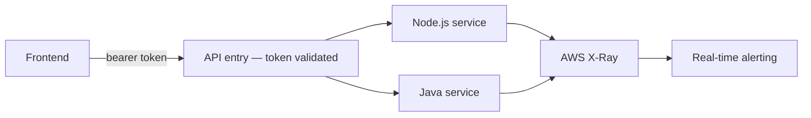

# The security work that only gets noticed when it's missing

**OLLMOO — London, UK (remote) — Software Engineer & DevOps Specialist, 2022–2024**
*(the platform this secures: [`09-cloud-native-saas-platform`](../09-cloud-native-saas-platform))*

## Why this doesn't get its own diagram-worthy infrastructure story

Infrastructure security gets a project name, a network diagram, a clear before/after. Application
security on a product like this one is usually just "the middleware" — unglamorous, easy to
underinvest in, and, in my experience, exactly where most of the actual risk on a product like
this lives. Three languages, three service boundaries, and every one of them needing a consistent
answer to "is this caller allowed to do this specific thing" — which is a harder question to
answer consistently than it sounds when you're a small team shipping features under deadline
pressure every week.

## The decisions I made to take the answer out of individual developers' hands

**Authentication got centralized at the entry point.** OAuth 2.0 and OIDC validate every request
before it reaches any service (`scripts/auth-middleware.js`), so no individual service
reimplements its own version of "check the token," each slightly differently, each a slightly
different place for a bug to hide.

**Authorization stayed separate from authentication, deliberately.** A valid token proves who's
calling. It says nothing about what they're allowed to do — those are two different questions, and
conflating them is a common source of privilege-escalation bugs I've seen elsewhere. Role checks
happen per service, against the specific action being requested, not as a blanket "logged in
means allowed."

**The defenses that get skipped under pressure got moved into shared middleware, not left as
individual discipline.** Input validation, output encoding against XSS, CSRF protection on
state-changing routes — these are exactly the things a feature developer under a Friday-afternoon
deadline forgets, not because they don't know better, but because remembering isn't the same as
having it enforced structurally. I made these part of the framework every request goes through,
not a checklist item in a PR template.

## The tracing half, and why it mattered as much as the security half

With three services in the request path, "why did this specific request fail" used to mean opening
three separate logs and reconstructing a timeline by hand, under pressure, while a customer waited.
AWS X-Ray (`scripts/tracing-config.js`) turned that into a single trace per request. This is the
actual, unglamorous reason MTTR dropped **60%** — not a smarter on-call engineer showing up, just
meaningfully less time spent figuring out what happened before anyone could start fixing it.

## The honest framing of why this work matters

Nobody sends a thank-you note for the CSRF token that quietly did its job. That invisibility is
exactly why this category of work is easy to underinvest in on a small, fast-moving team — and
exactly why I built it into the shared path rather than trusting it to anyone's individual
discipline under deadline pressure, mine included.
