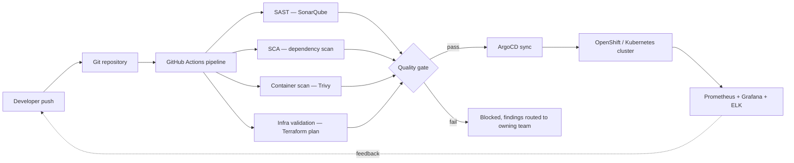

# Enterprise CI/CD Platform Modernization & DevOps Transformation

**Employer:** Onclusive — Senior DevSecOps Engineer · **Timeframe:** 2026 · **Role:** Sole platform
engineer, designed and delivered end to end · **Client:** withheld under NDA

## Summary

A centralized CI/CD platform replacing a patchwork of per-team pipelines across 30+
microservices, with automated security quality gates built in from the start rather than bolted
on afterward.

## The challenge

Before this platform, each development team maintained its own build/test/deploy tooling —
inconsistent quality checks, no shared security gating, and a slow onboarding path for new
engineers who had to learn a different pipeline for every service they touched.

## Architecture

## Implementation

- **Pipeline standardization**: one templated GitHub Actions workflow (`scripts/ci-pipeline.yml`)
  parameterized per service, replacing bespoke per-team scripts — every one of the 30+
  microservices builds, tests, and deploys through the same gated path.
- **GitOps delivery**: ArgoCD watches each service's deployment manifests and reconciles the
  cluster to match — no manual `kubectl apply` in the production path (`scripts/argocd-app.yaml`).
- **Infrastructure as code**: Terraform modules provision the shared platform infrastructure
  (runners, registries, cluster add-ons) with the same review/plan/apply discipline as
  application code (`scripts/platform.tf`).
- **Self-service onboarding**: a documented deployment template and internal workshops let a new
  engineer stand up a service on the platform without a platform-team hand-hold.

## Security

Quality gates are enforced, not advisory — a failed SAST, SCA, container-scan, or Terraform-plan
check blocks the merge rather than just posting a warning. Findings route to the owning team with
severity thresholds attached, not into a shared backlog nobody reads.

## Outcomes

- **+60%** deployment frequency across the platform
- **−45%** production incidents after rollout
- **−80%** vulnerabilities reaching production (caught earlier, in the gate)
- **95%** of findings remediated pre-production rather than found after release
- **−50%** onboarding time for new engineers joining a service on the platform

## Lessons

Standardizing the pipeline paid off faster than standardizing the security gates — teams adopted
the shared build/deploy workflow readily once it saved them work, but needed the findings-routing
and severity-threshold design before they trusted the gates enough to stop working around them.

## Tech stack

GitHub Actions, ArgoCD, OpenShift, Kubernetes, Helm, Terraform, SonarQube, Trivy, Prometheus,
Grafana, ELK Stack, HashiCorp Vault (secrets)

## Related

- Service: [DevOps & CI/CD Automation](https://nearvic.com/services/devops) *(planned — see nearvic.com's roadmap)*
- Re-cut through a security lens: see [`02-devsecops-shift-left`](../02-devsecops-shift-left) and [`03-kubernetes-workload-hardening`](../03-kubernetes-workload-hardening) in this same portfolio — same platform, different discipline
