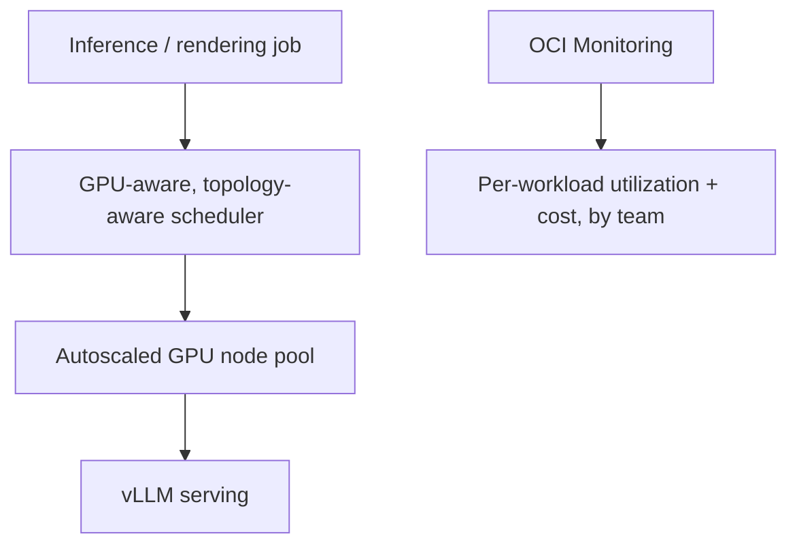

# Making expensive GPUs somebody's accountability, not a shared mystery bill

**OneCloud — Cloud & DevOps Engineer, 2025**

GPU capacity is the one infrastructure line item everyone notices on the invoice and almost nobody
can explain. This platform ran NVIDIA GPU fleets on OCI for rendering, simulation, and large-model
inference, and my job wasn't just "make it scale" — it was making sure that when someone asked
"why does this cost what it costs," there was a real answer instead of a shrug.

## Where the actual engineering was

Autoscaling GPU node pools sounds simple until you notice that idle GPU capacity is the most
expensive kind of idle capacity there is — so the scaling policy I built
(`scripts/gpu-nodepool-autoscaling.yaml`) scales out only when GPU-requesting work is actually
queued, and scales back in aggressively the moment it's not. vLLM handled large-model inference
serving on top of that. And I spent more time than I expected on topology — a multi-node inference
job spread across GPUs with a bad interconnect path runs *worse* than the same job on fewer,
correctly-placed GPUs. That reframed the whole scaling conversation on this project from "add more
GPUs" to "place the ones you have correctly first," which is a cheaper and better answer nine
times out of ten.

## The dashboard that actually got used

`scripts/gpu-cost-dashboard.json` is the OCI Monitoring setup that turned "the GPU bill" from a
shared, unowned number into per-team, per-workload attribution. That single change did more for
how the platform was perceived internally than any amount of scheduler tuning — once a team could
see their own number, GPU usage stopped being everyone's problem and nobody's job.

## Facility, not an afterthought

All of this ran inside an ISO 27001 / PCI DSS certified facility — a given constraint the platform
was built on top of, not something I had to solve myself, but worth stating plainly since it's the
kind of detail that matters to whoever's evaluating where their workloads actually run.

## What it added up to

An autoscaled, multi-node GPU fleet doing real inference and rendering work, with per-workload
cost attribution that made the spend defensible instead of just large.
