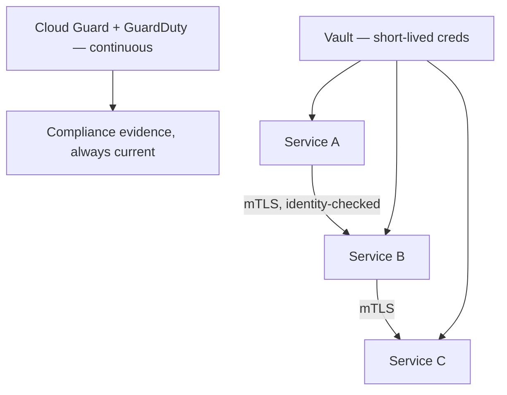

# Zero trust, for a system that can't afford to guess

**OneCloud — Cloud & DevOps Engineer, 2024–2025**
*(security lens on the migration in [`05-multicloud-banking-migration`](../05-multicloud-banking-migration))*

"Trusted internal network" isn't a security boundary a bank can stand behind in front of a
regulator, and honestly it isn't one I'd want to stand behind anywhere. When I designed the
security model for the destination environment in the migration above, the decision was: no
service trusts another service just because they're on the same network. Every call proves who it
is.

## How that actually works, not just as a slogan

Istio service mesh enforces mutual TLS on every service-to-service call
(`scripts/istio-peer-authentication.yaml`) — I rolled it out in permissive mode first specifically
to find the services that had been quietly relying on unauthenticated internal calls, then flipped
to strict once I knew what would break and fixed those first. HashiCorp Vault issues short-lived
database credentials and certificates instead of long-lived static secrets
(`scripts/vault-policy.hcl`), so a leaked credential is a small problem with an expiry date instead
of an open door. And OCI Cloud Guard plus AWS GuardDuty run continuously against the regulatory
baseline — compliance as something the system proves every minute, not something an auditor
confirms once a quarter.

## The judgment call worth flagging

Going straight to strict mTLS mesh-wide would have broken things blind — permissive mode first was
the only way to find every quiet dependency on unauthenticated calls without an incident. That
sequencing decision is the actual work here; Istio doing the enforcement is the easy part once
you've made it.

## Where it landed

**mTLS by default** across every service-to-service call. **99.9%** environment consistency —
shared with the migration this secures, because zero-trust wasn't retrofitted after cutover, it
was the environment's default state from day one. Automated, continuous compliance checks against
the regulatory baseline this platform had to meet.

*Same employer, same period, a different client:
[`07-oci-compute-cloud-at-customer`](../07-oci-compute-cloud-at-customer).*
