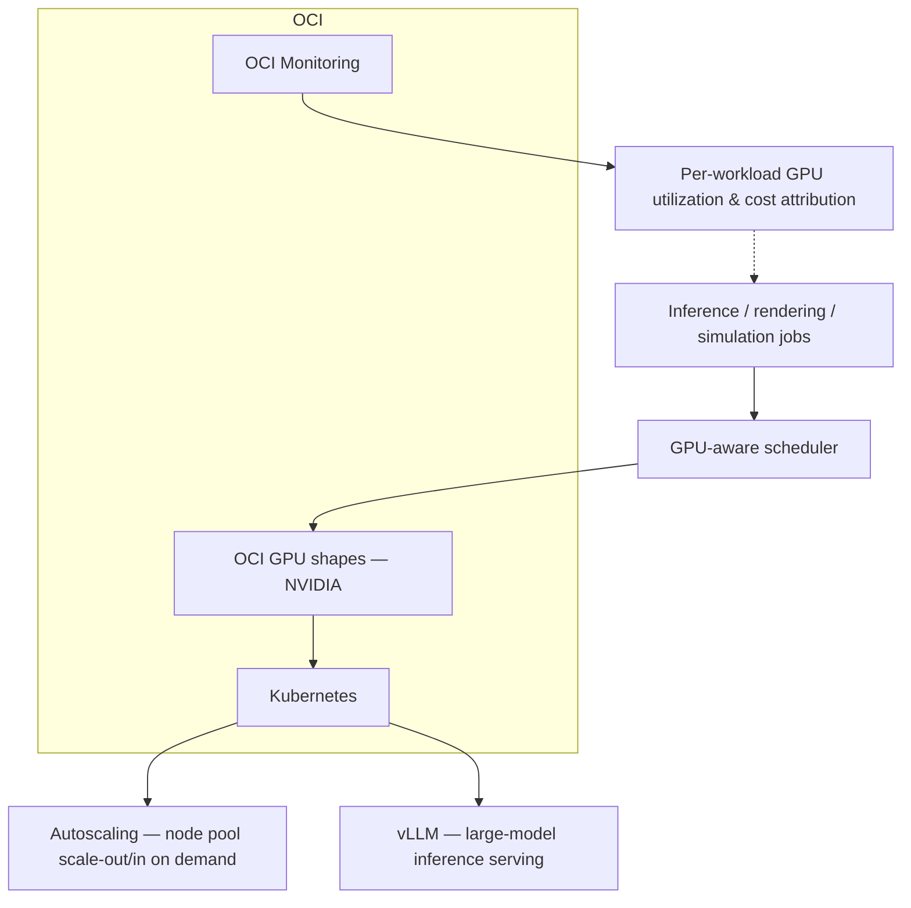

# GPU Infrastructure for AI/Inference Workloads

**Employer:** OneCloud — Cloud & DevOps Engineer · **Timeframe:** 2025 · **Role:** Sole
infrastructure engineer for the GPU platform · **Client:** withheld under NDA

## Summary

An autoscaled, multi-node NVIDIA GPU fleet on OCI for rendering, simulation, and large-model
inference — built so that expensive silicon is accountable per workload, not a shared cost
nobody can attribute.

## The challenge

GPU capacity is expensive and, unmanaged, easy to under-utilize or over-provision — the platform
needed to scale a GPU fleet up and down with real demand, tune network/topology for the
workloads actually running (inference has different bandwidth/latency needs than training or
rendering), and make cost attributable per workload rather than a lump line item.

## Architecture

## Implementation

- **Autoscaled GPU node pools**: Kubernetes cluster autoscaler tuned specifically for GPU node
  pools (`scripts/gpu-nodepool-autoscaling.yaml`) — GPU nodes scale out only when GPU-requesting
  workloads are actually pending, and scale back in aggressively once idle, since GPU capacity
  sitting idle is the most expensive kind of idle capacity.
- **Inference serving**: vLLM handles large-model inference serving on top of the GPU-scheduled
  Kubernetes workloads, tuned for the throughput/latency profile the actual models needed.
- **Topology-aware scheduling**: multi-node jobs get GPU topology hints so intra-job
  communication stays on the fastest available interconnect rather than crossing unnecessary
  network hops.
- **Per-workload cost attribution**: OCI Monitoring dashboards (`scripts/gpu-cost-dashboard.json`)
  tag GPU utilization by workload/team, turning "the GPU bill" from a shared unknown into a
  per-team, per-workload number.

## Security

Provisioned within an ISO 27001 / PCI DSS certified facility — the physical and compliance
posture of the underlying OCI infrastructure was a given constraint this platform was built on
top of, not something this project itself implemented.

## Outcomes

- **Autoscaled, multi-node GPU fleet** running rendering, simulation, and large-model inference
  workloads
- **Per-workload cost attribution and tuning** — expensive silicon made accountable
- Delivered inside an **ISO 27001 / PCI DSS certified** facility

## Lessons

Topology tuning mattered more than raw GPU count for multi-node inference throughput — a job
spread across nodes with a bad interconnect path performed worse than the same job on fewer,
better-placed GPUs, which reframed the scaling conversation from "add more GPUs" to "place them
correctly first."

## Tech stack

OCI GPU shapes, NVIDIA, vLLM, Kubernetes, Terraform, OCI Monitoring

## Related

- [`07-oci-compute-cloud-at-customer`](../07-oci-compute-cloud-at-customer) — another OneCloud OCI engagement, same period
