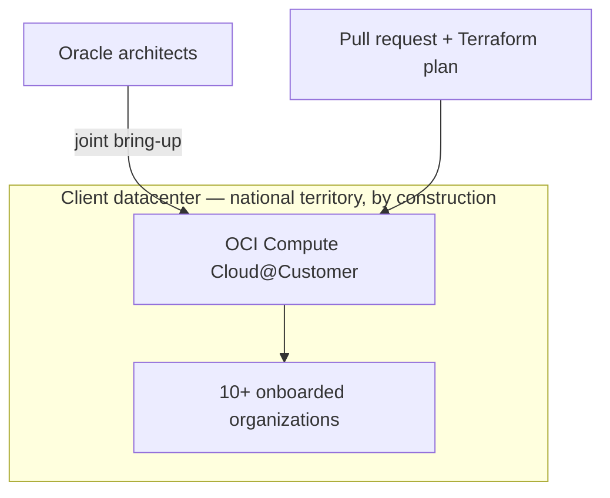

# The first OCI rack of its kind in the country, and no local playbook to follow

**OneCloud — Cloud & DevOps Engineer, 2025**

## The constraint that ruled out the obvious answer

Some workloads have a data-residency requirement that isn't a policy preference, it's a legal
fact: the data does not leave the country, in any form, ever. That rules out every public-region
cloud option by definition. The obvious fallback — build a bespoke private cloud in the client's
own datacenter — solves the residency problem and creates a new one: a bespoke platform is a
platform someone has to maintain forever, and it drifts further from anything a vendor actually
supports with every year that passes.

The answer that avoided both problems was Oracle Compute Cloud@Customer: a full OCI region,
running as physical hardware inside the client's own datacenter, giving them the real managed-OCI
experience without the data ever leaving the building. This was the first C3 installation in the
country. There was no local precedent, no "here's how the last deployment here went" to draw on.
Oracle sent their own architects for the physical bring-up, and I worked the deployment directly
alongside them.

## What I made sure got captured, not just delivered

Getting the rack live once, with Oracle's own architects standing next to me, isn't the part of
this that scales. The part that scales is what happens when the tenth organization wants onto
the platform and there's no Oracle architect flying back in for that one. From day one, I put
Terraform (`scripts/c3-tenancy.tf`) and OCI DevOps behind every tenant onboarding, and built a
GitHub Actions pipeline (`scripts/tenant-onboarding.yml`) that turns "bring a new organization onto
the shared platform" into a pull request with a Terraform plan attached — reviewable, auditable,
repeatable — instead of a support ticket that lands on whoever happens to be free that week.

## Why "first" is the actual difficulty here

Being first meant the runbook for the physical and logical bring-up had to be written *while*
doing it, under a deadline, with no fallback to "check how we did it last time" because there was
no last time. Every organization onboarded since has benefited from decisions I only got one real
chance to make correctly — which is a different kind of pressure than executing a known playbook,
and honestly the part of this engagement I found most demanding.

## What it holds up to today

**1st** OCI Compute Cloud@Customer deployment in the country. **10+** organizations onboarded onto
one shared platform, through a repeatable process rather than one-off manual setup each time.
**100%** data residency maintained — the entire reason the project existed, and it holds by
construction, because the hardware itself never physically leaves the building, not because of a
data-handling policy someone has to remember to enforce.

*Different client, same employer and period: [`08-gpu-inference-infrastructure`](../08-gpu-inference-infrastructure).*
