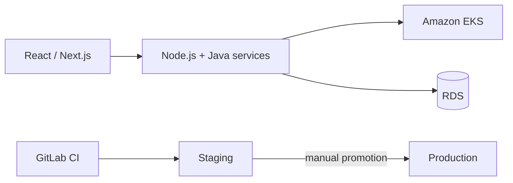

# Building the product and the platform it runs on, as one job

**OLLMOO — London, UK (remote) — Software Engineer & DevOps Specialist, 2022–2024**
*(security and observability on this same platform: [`10-appsec-observability-saas`](../10-appsec-observability-saas))*

## Why this one reads differently from the rest of this portfolio

Worth saying plainly up front: I wasn't brought onto this team as a dedicated platform engineer
supporting someone else's product roadmap. I was building the product itself — React and Next.js
on the front end, Node.js and Java services underneath — and the infrastructure and CI/CD it ran
on, as one combined responsibility, for a small London-based team working fully remote. Every
infrastructure decision here got made by someone who was also shipping features that same week,
which is a genuinely different constraint than working as a dedicated platform team, and it shows
in the choices.

## Decisions made against a maintenance budget, not a purity standard

Services run containerized on EKS rather than hand-managed on raw EC2 instances, because scaling
and rolling deploys belong to the cluster's scheduler, not to a runbook someone has to execute
correctly under pressure. Infrastructure got split between CloudFormation and Terraform
(`scripts/eks-cluster.tf`) rather than forced entirely into one tool — CloudFormation for AWS
primitives where Terraform's provider support was rougher at the time, Terraform for the cluster
and networking layer where its module ecosystem was genuinely better. That's not the tidy
one-tool answer a platform-engineering purist would pick. It was the answer that a two-hatted
engineer could actually keep working correctly while also shipping product features in parallel,
which was the real constraint I was optimizing against.

GitLab CI (`scripts/gitlab-ci.yml`) took the pipeline from "no automated tests at all" to a real
build → test → staging → production flow, with production promotion left as a deliberate manual
step rather than fully automatic. On a small team without a dedicated release manager watching
every deploy, I wanted a human decision point before anything hit production — not because the
automation couldn't have handled it, but because the team didn't have the on-call depth yet to
recover quickly from something automation shipped unattended at the wrong moment.

## What "restructuring" actually meant in practice

The **25%** performance improvement I'm credited with here didn't come from one clever fix
somebody can point to in a demo. It came from going through the accumulated shortcuts the
codebase's early, fast-and-loose growth phase had left behind — the unglamorous kind of work that
doesn't produce a satisfying before/after screenshot but is, in my experience, most of what
"improving application performance" actually looks like on a real product with real history
behind it.

## Where it landed

A full-stack product shipped and kept running by a small remote team. Automated testing and a real
CI/CD pipeline where there'd been essentially none. Staging and production that stay in sync with
each other instead of quietly drifting apart — which, on small teams without dedicated platform
support, is the failure mode I've seen kill more velocity over time than any single dramatic
outage.
