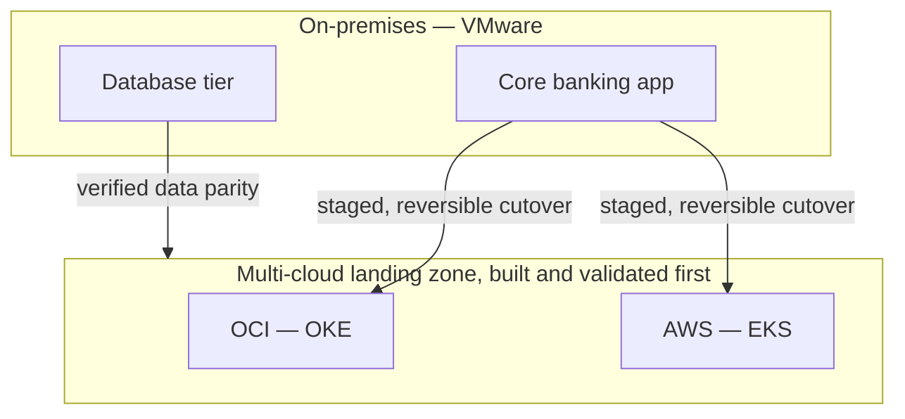

# Moving a live bank off VMware without a single unplanned outage

**OneCloud — Cloud & DevOps Engineer, 2024–2025**
*(security architecture of this same migration: [`06-zero-trust-financial-workloads`](../06-zero-trust-financial-workloads))*

I led the migration of core banking applications — 500K+ daily transactions — off an on-premises
VMware estate onto a multi-cloud architecture across OCI and AWS. In most industries "the
migration went a bit rough for a week" is an inconvenience. In banking, an outage during a cutover
is a regulatory event with a paper trail. That constraint shaped every decision on this project
more than any technology choice did.

## The plan I actually ran

I didn't move anything until the destination existed and was validated — landing zones,
network topology, IAM boundaries defined in Terraform (`scripts/landing-zone.tf`) and stood up on
both clouds before a single workload moved. Ansible (`scripts/compliance-baseline.yml`) applied
one compliance baseline to every instance, which mattered more than it sounds: the on-premises
estate had years of accumulated configuration drift, one-off fixes nobody documented, servers that
were "special" for reasons lost to history. Automating the baseline was as much about breaking
that inheritance as it was about the new infrastructure.

Cutover itself was staged, not a weekend big-bang. Each stage had a defined rollback path, which
cost more up-front planning time than doing it in one shot would have. On a system where 500K+
daily transactions and a regulator are both real, I'd make that trade every time.

## What it actually took

Migrating a regulated financial system isn't a lift-and-shift with extra paperwork — data
residency and compliance posture had to hold throughout the move, not just at the destination.
That's the reason this gets its own write-up rather than folding into a generic "cloud migration"
story: the hard part was never the Terraform, it was proving at every stage that the constraint
still held.

## The numbers

**500K+** daily transactions kept running. **99.9%** availability held through the cutover itself.
**Zero** unplanned outages attributable to the migration. **35%** lower infrastructure cost once it
landed. **70%** faster provisioning going forward, and configuration drift — the thing that had
quietly accumulated for years on-prem — effectively eliminated, at **99.9%** environment
consistency.

I'd rather report a boring migration than an exciting one. This was boring, on purpose.
