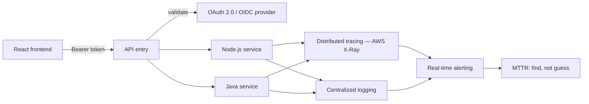

# Application Security & Observability for the SaaS Platform

**Employer:** OLLMOO (London, UK — remote) — Software Engineer & DevOps Specialist ·
**Timeframe:** 2022–2024 · **Role:** Application security + observability ·
**Client:** product team, withheld under NDA

> Security/observability lens on the same platform covered in
> [`09-cloud-native-saas-platform`](../09-cloud-native-saas-platform).

## Summary

Where the platform-engineering side of this work (see
[`09-cloud-native-saas-platform`](../09-cloud-native-saas-platform)) covered infrastructure and
delivery, this side covered what happens inside the application: authentication, authorization,
input handling — and, once running, being able to actually find and fix problems fast.

## The challenge

A cloud-native application split across React, Node.js, and Java microservices needs a
consistent authentication/authorization story across all of them, and consistent
application-layer defenses (injection, XSS, CSRF) that don't get skipped under delivery pressure
when a team is moving fast on product features.

## Architecture

## Implementation

- **Token-based authentication**: OAuth 2.0 and OIDC handle authentication across services, with
  bearer tokens validated at the API entry point rather than each service reimplementing its own
  auth check (`scripts/auth-middleware.js`).
- **Role-based authorization**: enforced per service, so a valid token doesn't imply a caller can
  do anything — each service checks the caller's role against the specific action.
- **Application-layer defenses**: input validation, injection prevention, output encoding
  against XSS, and CSRF protection on state-changing routes — the defenses that get dropped
  under delivery pressure were made part of the shared middleware, not left to each feature
  developer to remember.
- **Observability**: distributed tracing via AWS X-Ray plus centralized logging and real-time
  alerting (`scripts/tracing-config.js`) turned "where did this request fail" from a
  multi-service log hunt into a single trace.

## Security

This is the application-layer counterpart to the platform/infrastructure security implicit in
[`09-cloud-native-saas-platform`](../09-cloud-native-saas-platform) — token validation and
role checks happen inside the application, independent of network-level controls.

## Outcomes

- **OAuth 2.0 and OIDC** token-based auth across all services
- **−60%** mean time to resolution (MTTR), from the combined tracing/logging/alerting stack
- Application-layer defenses (injection, XSS, CSRF) built into shared middleware rather than
  per-feature responsibility

## Lessons

Putting the auth check and the application-layer defenses in shared middleware, rather than
trusting each service/feature to reimplement them correctly, was the single highest-leverage
decision here — it meant a new feature got these protections by default instead of by reminder.

## Tech stack

Node.js, Java, React, OAuth 2.0, OIDC, bearer tokens, AWS EKS, AWS X-Ray, GitLab CI

## Related

- [`09-cloud-native-saas-platform`](../09-cloud-native-saas-platform) — the platform this secures and instruments
- [`04-security-observability-stack`](../04-security-observability-stack) — a similar observability approach at a different employer/scale
