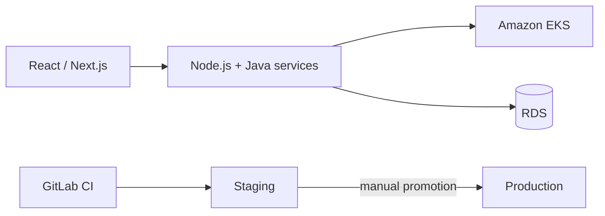

# Building the product and the platform it runs on, at the same time

**OLLMOO — London, UK (remote) — Software Engineer & DevOps Specialist, 2022–2024**
*(security and observability on this same platform: [`10-appsec-observability-saas`](../10-appsec-observability-saas))*

This one's different from the rest of what's in this portfolio, and worth saying so plainly: I
wasn't brought in as a dedicated platform engineer bolted onto someone else's product team. I was
building the product — React and Next.js on the front end, Node.js and Java services underneath —
and the CI/CD and infrastructure it ran on, as one job, for a small London-based team working
remote.

## Why the infrastructure choices look different here

There was no separate platform team to hand infrastructure work to, which meant every choice had
to earn its maintenance cost against active feature work happening in parallel. Services run
containerized on EKS rather than hand-managed EC2, so scaling and rolling deploys are the
cluster's job. CloudFormation and Terraform split the AWS surface between them
(`scripts/eks-cluster.tf`) — CloudFormation for the primitives Terraform's AWS support handled less
cleanly at the time, Terraform for the cluster and networking, rather than forcing everything
through one tool for the sake of tidiness. And GitLab CI (`scripts/gitlab-ci.yml`) took the
codebase from "no automated tests" to a real build → test → staging → production pipeline, with
production promotion gated as a manual step rather than automatic — a deliberate call, since this
was a small team without a dedicated release manager watching every deploy.

## What "restructuring" actually meant

The **25%** performance improvement didn't come from one clever fix — it came from going through
the system restructuring the codebase's early, fast-and-loose growth had left behind, the kind of
work that's unglamorous and doesn't get a nice before/after screenshot, but is most of what
"improving application performance" actually looks like in practice on a real product.

## Where it landed

Full-stack product shipped and maintained. Automated testing and CI/CD introduced where there'd
been none. Clean staging-to-production promotion instead of hand-built environments quietly
drifting apart from each other, which is the failure mode I've seen kill more small teams'
velocity than any single outage has.
