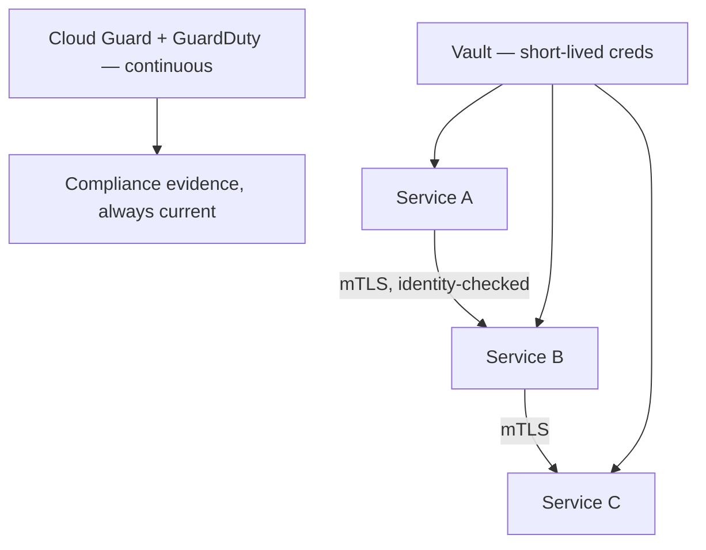

# Zero trust, for a system that can't afford to guess

**OneCloud — Cloud & DevOps Engineer, 2024–2025**
*(security lens on the migration in [`05-multicloud-banking-migration`](../05-multicloud-banking-migration))*

## The assumption I refused to carry forward

"This service is trusted because it's on our internal network" is not an assumption I'll design
around for a financial platform, and honestly I've stopped being comfortable with it anywhere.
When I designed the security model for the destination environment in the migration above, the
starting principle was simple to state and genuinely hard to implement everywhere: no service
trusts another service on the basis of network location. Every call proves its identity, every
time, regardless of where it's coming from.

## How that principle turned into actual infrastructure

**Mutual TLS became the default for every service-to-service call**, enforced through an Istio
service mesh (`scripts/istio-peer-authentication.yaml`). I didn't flip straight to strict
enforcement. I ran the mesh in permissive mode first, specifically to surface every service that
had been quietly relying on unauthenticated internal calls — and there were several, which is
exactly why I ran it that way rather than assuming the system was already clean. Once I had that
list, I fixed those services first, then moved the mesh to strict enforcement.

**Secrets stopped being long-lived.** HashiCorp Vault issues short-lived database credentials and
certificates per service (`scripts/vault-policy.hcl`) instead of static secrets that sit valid
indefinitely. A leaked credential under this model is a small, time-boxed problem instead of an
open door — the difference between rotating a secret manually every quarter (if anyone remembers
to) and a secret that expires on its own within the hour whether anyone remembers or not.

**Compliance became something the system proves continuously, not something an auditor confirms
once.** OCI Cloud Guard and AWS GuardDuty run continuously against the regulatory baseline this
platform had to meet, generating evidence as a byproduct of normal operation rather than as a
scramble before an audit date.

## The sequencing decision that actually mattered here

Going straight to strict mTLS enforcement mesh-wide would have broken things blind, on a
production banking platform, with no way to know in advance what would break or how badly. Running
permissive-then-strict cost extra calendar time. It's also the only sequencing I'd trust myself
to sign off on for a system at this level of consequence — I wanted the list of hidden
dependencies in hand before I ever flipped a switch that could take down a production financial
service.

## What zero-trust here actually delivered

**mTLS by default** across every service-to-service call, with no exceptions carved out. **99.9%**
environment consistency — the same figure reported for the migration itself, because this wasn't
retrofitted after cutover; it was the environment's baseline state from the day the first
workload landed on it. Automated, continuous compliance evidence against the regulatory standard
this platform operates under.

*Same employer, same period, a different client:
[`07-oci-compute-cloud-at-customer`](../07-oci-compute-cloud-at-customer).*
