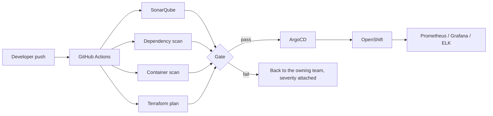

# One CI/CD platform, 30+ services, no more "it works on my team's pipeline"

**Onclusive — Senior DevSecOps Engineer, 2026**

## The state of things when I picked this up

Every team had built its own pipeline, on its own timeline, under its own deadline pressure. Some
were genuinely good. Most were whatever got a service shipped two years ago and never got
revisited since — a mix of Jenkins jobs one team understood, GitHub Actions workflows another team
copy-pasted from a blog post, and at least one service that deployed via a script someone ran from
their laptop because "the pipeline broke once and nobody had time to fix it properly."

The cost of that wasn't just inconsistency. It was that security had no consistent foothold
anywhere. A team could ship straight to production without a single automated check, because
nothing forced otherwise — it wasn't that anyone was being reckless, it's that "add a scanner" was
never anyone's job when every team owned its own tooling. And onboarding a new engineer meant
learning whatever pipeline their specific service happened to have, which is a genuinely bad way
to spend someone's first two weeks.

## Why I didn't lead with a mandate

My first instinct wasn't "get engineering leadership to mandate migration to a new platform." I've
seen that approach before, and it produces reluctant compliance at best — teams migrate the
minimum required and quietly keep workarounds for anything the new platform makes harder. Instead
I built the platform to be a genuinely better deal than what teams already had: faster builds
through shared caching, one less config file to maintain, self-service deployment templates that
worked out of the box. Migration became something teams asked for once two or three services had
already moved and their owners started asking why theirs hadn't.

## What's actually running

Every one of the 30+ microservices goes through the same path now: build and unit test, then
three parallel gates — SonarQube for static analysis, Trivy for both dependency and container
image scanning, and a Terraform plan/validate check for anything touching infrastructure. All
three have to pass before ArgoCD picks up the change and reconciles the cluster. Nothing reaches
`main` with an unresolved Critical or High finding, and that's enforced by a status check, not a
review-checklist item someone can wave through under deadline pressure.

## The design decision that actually mattered

Anyone can wire a scanner into a pipeline in an afternoon. The engineering work was in what
happens after the scanner fires, because that's where every security program I'd seen fail
actually failed. Early drafts of this design routed every finding into one shared security
backlog — the "safe" default, since it centralizes visibility. It also meant findings sat there
indefinitely, because nobody triaging a shared backlog has the context to know if a given finding
in a service they don't own is a real risk or a false positive, so they default to leaving it for
someone else.

I rebuilt the routing so a finding goes directly to the team that owns the code, tagged with
severity, with the fix path already available — a self-service Terraform module for
infrastructure findings, a pre-approved base image for container findings — so acting on it
doesn't mean opening a ticket and waiting on a platform team. That's the actual difference between
a gate people quietly route around and a gate people trust enough to use without being told to.

## Rollout, not a cutover

I didn't flip all 30+ services onto the new gates simultaneously. I moved a handful of
lower-traffic services first, watched what broke (a couple of legacy dependency patterns that
Trivy flagged as vulnerable but that the team already knew about and had compensating controls
for — which told me the severity thresholds needed a documented exception path, not just a hard
block), fixed the design, then rolled the rest through in waves. A platform this central to how 30+
teams ship code doesn't get one shot to be right; it gets to learn from the first few migrations
before the rest depend on it.

## What changed, in numbers that matter to whoever's evaluating this

Deployment frequency is up **60%** — teams ship more often once they're not each maintaining a
half-working pipeline solo. Production incidents are down **45%**. Findings that used to reach
production and get caught later are now caught pre-merge **95%** of the time, and the total volume
reaching production is down **80%**. Onboarding time for a new engineer joining a service dropped
**50%**, because there's one thing to learn instead of thirty variations of one thing.

None of those numbers moved because the tooling was clever. They moved because the gate was fast
enough and the routing was clear enough that engineers stopped treating security as a tax on
shipping and started treating it as part of shipping.

*Same platform, cut two other ways: [`02-devsecops-shift-left`](../02-devsecops-shift-left) covers
the program and process side of these gates; [`03-kubernetes-workload-hardening`](../03-kubernetes-workload-hardening)
covers what happens to a workload once it's actually running on the cluster.*
