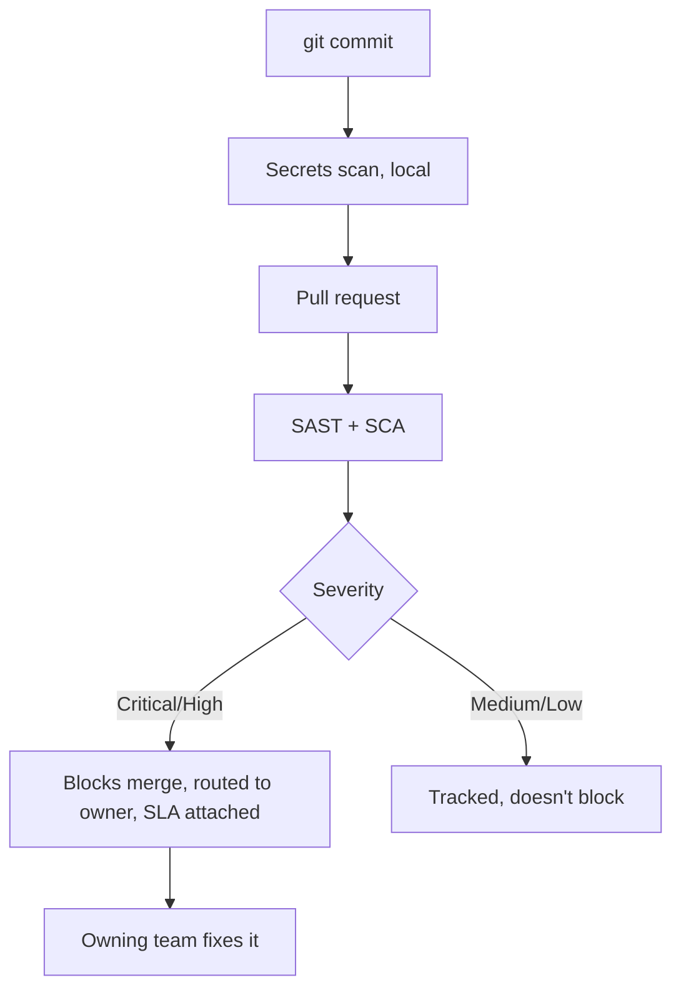

# Getting engineers to trust the scanner instead of clicking past it

**Onclusive — Senior DevSecOps Engineer, 2026**
*(the security program built on top of the platform in [`01-enterprise-cicd-platform`](../01-enterprise-cicd-platform))*

## The problem underneath the problem

By the time I got involved in this piece specifically, scanning wasn't the gap — SAST, SCA, and
secrets detection were already running. What wasn't working was that findings were being generated
faster than anyone could act on them meaningfully, and I'd watched this exact failure mode before:
a scanner that produces more noise than signal doesn't get ignored gradually, it gets ignored
almost immediately, and once engineers learn to click past a red X, getting them to take the next
one seriously is much harder than getting it right the first time.

So the actual brief I gave myself wasn't "add more security checks." It was "make the checks
that exist worth trusting."

## Three decisions, and why each one looks the way it does

**Secrets scanning moved to the developer's laptop, not just CI.** A pre-commit hook
(`scripts/pre-commit-config.yaml`) catches a credential before it's ever committed, which matters
because a secret that reaches git history is compromised the moment it's pushed, regardless of
whether CI catches it thirty seconds later — you can't un-push a leaked key. Catching it at commit
time is strictly better and costs nothing extra once it's set up.

**Severity became the axis that decides blocking, not presence of a finding.** Critical and High
findings block the merge. Medium and Low get tracked, visibly, but don't stop anyone from
shipping. I made this call deliberately after watching the opposite policy fail elsewhere — a gate
that blocks on every single finding, regardless of real risk, teaches engineers to find
workarounds for the gate itself, because a policy that can't distinguish "this is exploitable
today" from "this is a style nit the linter also would have caught" reads as noise, not signal.

**Threat modeling stayed lightweight on purpose.** For anything architecturally significant — a
new service boundary, a new external integration, a new trust relationship — I built a short,
structured template (`scripts/threat-model-template.md`) meant to take thirty minutes in a room
with the owning team, not a formal document that takes two weeks to complete and gets skipped the
one time a deadline is tight. A thorough process nobody has time to run isn't a thorough process.
It's a process with an escape hatch built in by neglect.

## Why I think this is a management problem more than a tooling one

I've now watched security programs succeed and fail at more than one company, and the pattern
holds: the technology is rarely the reason a program fails. It's the incentive design. If the
easiest path for an engineer under a deadline is to work around the security control, they will,
every time, regardless of how sophisticated the control is. The job isn't to make circumventing
security harder — it's to make compliance the path of least resistance. Every decision in this
program was made against that test, not against "which tool has the best feature list."

## The proof it worked is that two numbers moved together

This program runs inside the same pipeline as the platform work in
[`01-enterprise-cicd-platform`](../01-enterprise-cicd-platform), so the headline numbers are
shared, and they're worth reading together rather than separately: deployment frequency up
**60%**, production incidents down **45%**, at the same time. Those two normally pull against each
other — velocity and safety are supposed to be a trade-off. Getting both to move in the same
direction at once is the actual evidence that the incentive design, not just the tooling, was
right.

*Runtime counterpart: [`03-kubernetes-workload-hardening`](../03-kubernetes-workload-hardening) —
what catches anything that slips past all of the above.*
