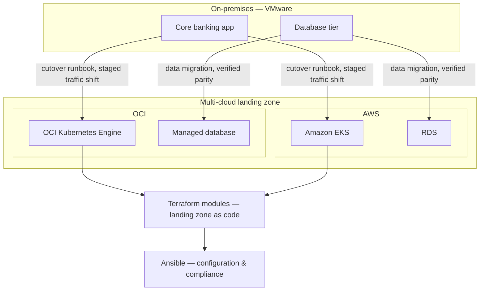

# Multi-Cloud Banking Platform Migration

**Employer:** OneCloud — Cloud & DevOps Engineer · **Timeframe:** 2024–2025 · **Role:** Led the
migration end to end · **Client:** banking/fintech client, withheld under NDA

> Re-cut through a security lens in [`06-zero-trust-financial-workloads`](../06-zero-trust-financial-workloads).

## Summary

End-to-end migration of core banking applications off on-premises infrastructure (including
VMware estates) onto a multi-cloud architecture across OCI and AWS — a live financial system,
serving 500K+ daily transactions, in an environment where an outage is a regulatory event, not
just an inconvenience.

## The challenge

On-premises infrastructure for a regulated financial workload doesn't move like a typical
lift-and-shift: the migration had to preserve data residency and compliance posture throughout,
with cutover runbooks precise enough that an outage during the move itself wasn't an option.

## Architecture

## Implementation

- **Landing zone as code**: Terraform modules (`scripts/landing-zone.tf`) defined the target
  network topology, IAM boundaries, and compute footprint on both OCI and AWS before any
  workload moved — the destination existed and was validated ahead of cutover, not built
  reactively during it.
- **Configuration automation**: Ansible playbooks (`scripts/compliance-baseline.yml`) applied a
  consistent compliance baseline across every provisioned instance, eliminating the
  configuration drift that on-premises estates had accumulated over years.
- **Cutover runbooks**: staged, reversible traffic shifts rather than a single big-bang cutover —
  each stage had a defined rollback path.

## Security

Migration ran alongside the zero-trust and compliance-automation work covered in
[`06-zero-trust-financial-workloads`](../06-zero-trust-financial-workloads) — the destination
environment wasn't just "the same app on new infrastructure," it enforced identity-based access
and automated compliance checks from the day it went live.

## Outcomes

- **500K+** daily transactions served by the migrated platform
- **−35%** infrastructure cost after migration
- **99.9%** availability held through the cutover itself
- **0** unplanned outages attributable to the migration
- **−70%** deployment/provisioning time via the Terraform + Ansible automation
- **99.9%** environment consistency — configuration drift eliminated

## Lessons

The staged, reversible cutover plan cost more up-front design time than a big-bang approach would
have, but on a system where 500K+ daily transactions and regulatory scrutiny are both real, the
ability to roll back a single stage rather than the whole migration was worth every hour spent
planning it.

## Tech stack

Terraform, Ansible, Kubernetes (OKE, EKS), OCI, AWS, VMware (source estate), Prometheus, Grafana, Loki

## Related

- [`06-zero-trust-financial-workloads`](../06-zero-trust-financial-workloads) — the security architecture of the destination environment
- [`07-oci-compute-cloud-at-customer`](../07-oci-compute-cloud-at-customer) — a related OneCloud engagement for a different data-residency constraint
