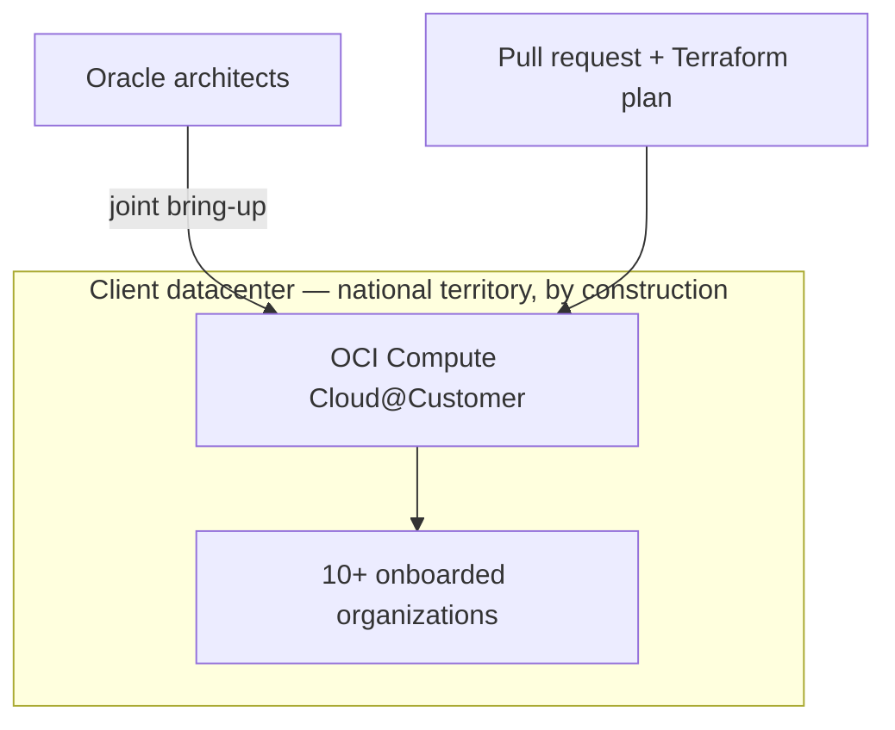

# The first OCI rack of its kind in the country, installed alongside Oracle's own team

**OneCloud — Cloud & DevOps Engineer, 2025**

Some workloads have a data-residency requirement that isn't negotiable: the data does not leave
the country. Public-region cloud is off the table by definition, but the client still wanted the
real OCI experience — managed services, not a bespoke private-cloud build that some team would be
patching by hand in three years because it drifted from anything Oracle actually supports.

The answer was Oracle Compute Cloud@Customer — a full OCI region, running as hardware inside the
client's own datacenter. This was the first C3 installation in the country, which meant there was
no local playbook to follow. Oracle sent their own architects for the physical bring-up, and I
worked the deployment alongside them.

## What I made sure didn't stay tribal knowledge

Getting the rack live once, with Oracle standing next to me, isn't the hard part in the long run.
The hard part is what happens when the tenth organization wants onto the platform and there's no
Oracle architect flying in for that one. I put Terraform (`scripts/c3-tenancy.tf`) and OCI DevOps
behind every tenant onboarding from day one, and wired a GitHub Actions pipeline
(`scripts/tenant-onboarding.yml`) so bringing a new organization onto the shared platform is a pull
request with a Terraform plan attached — reviewable, repeatable — not a support ticket that lands
on whoever's free.

## Why "first" actually mattered here

Being first meant capturing the bring-up runbook *while doing it*, not after — every organization
onboarded since has benefited from decisions I only got to make once, under a deadline, next to
people who'd done this in other countries but never this one.

## Result

**1st** C3 deployment in the country. **10+** organizations onboarded onto one shared platform.
**100%** data residency held — which was the entire point, and it held by construction, because
the hardware itself never left the building, not because of a policy someone had to remember to
enforce.

*Different client, same employer and period: [`08-gpu-inference-infrastructure`](../08-gpu-inference-infrastructure).*
