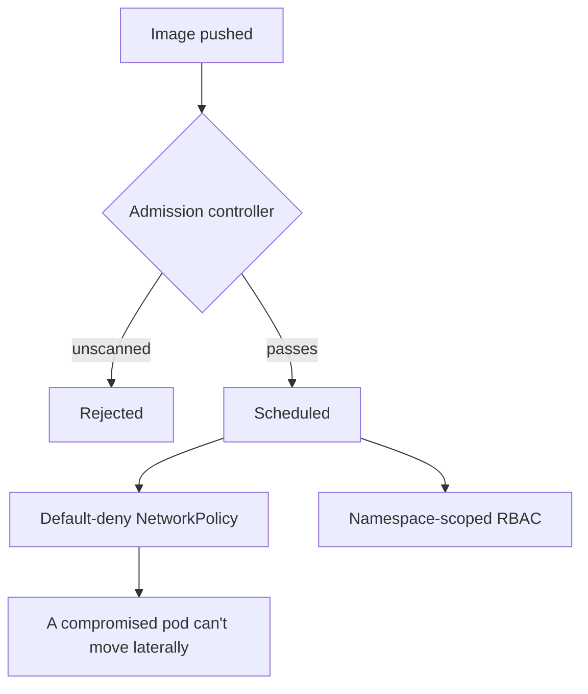

# A clean pipeline doesn't mean a safe cluster

**Onclusive — Senior DevSecOps Engineer, 2026**
*(runtime security for the same platform in [`01-enterprise-cicd-platform`](../01-enterprise-cicd-platform))*

Getting an image through a gated pipeline tells you it was scanned. It tells you nothing about
what that container is allowed to do once it's actually running — and mission-critical production
workloads were running with no boundary between them. Any pod could talk to any other pod. Service
accounts had more privilege than they used. If something did get through the pipeline gates, or a
workload was compromised at runtime through no fault of the pipeline at all, there was nothing on
the cluster side to contain it.

I closed that gap in three pieces.

**Admission control that actually checks provenance.** An OPA Gatekeeper policy
(`scripts/gatekeeper-constraint.yaml`) rejects any deployment whose image isn't from the scanned,
approved registry — enforced by the cluster itself, not something that relies on the pipeline
having done its job correctly every single time.

**Network policy, default-deny.** Every namespace starts closed (`scripts/network-policy.yaml`).
Services get explicit allow rules for exactly the traffic they need. I rolled this out namespace by
namespace with a monitoring window before flipping enforcement on, because the first attempt at
doing it cluster-wide broke legitimate traffic I hadn't accounted for — lesson learned the
expensive way once, applied carefully after.

**RBAC scoped to what a service actually needs.** No cluster-admin service accounts for
application workloads, full stop (`scripts/rbac.yaml`).

## Why I think about it this way

I've seen the "our pipeline is secure" answer used to paper over a cluster that would let a
compromised container reach anything on the network. Pipeline security and runtime security are
different problems with different failure modes, and treating them as the same conversation is
how you end up with a false sense of coverage. This project exists because I'd rather have both
layers and never need the second one, than have one layer and find out the hard way it wasn't
enough.

## What it's worth

This is part of what keeps the platform at **99.9%** uptime and holding **45%** fewer incidents —
a workload that misbehaves inside a default-deny network can't turn into a wider incident, because
it physically can't reach anything it wasn't explicitly allowed to.

*Detection layer: [`04-security-observability-stack`](../04-security-observability-stack) — how a
violation here actually gets seen.*
