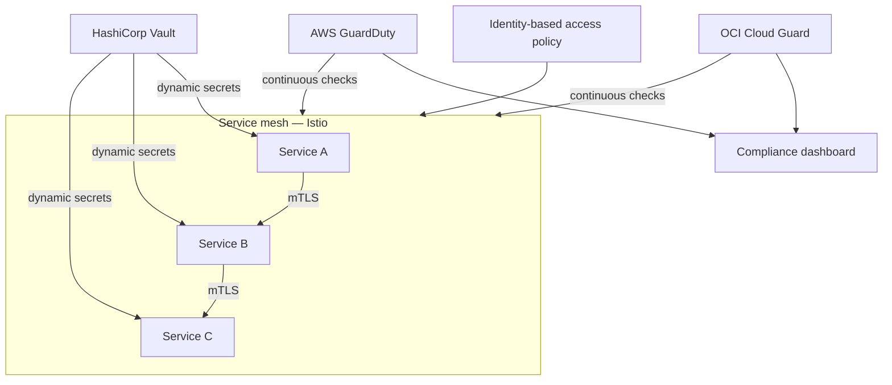

# Zero-Trust Architecture for Financial Workloads

**Employer:** OneCloud — Cloud & DevOps Engineer · **Timeframe:** 2024–2025 · **Role:** Security
architecture lead for the migration · **Client:** banking/fintech client, withheld under NDA

> Security lens on the same engagement covered in
> [`05-multicloud-banking-migration`](../05-multicloud-banking-migration).

## Summary

The migrated banking platform didn't just move to new infrastructure — it moved to a
zero-trust model: identity-based access instead of flat network trust, microsegmentation between
workloads, mutual TLS for east-west traffic, and compliance checks that run continuously rather
than the week before an audit.

## The challenge

A financial workload under regulatory scrutiny can't rely on "trusted internal network" as a
security boundary — every service-to-service call needed to prove its identity, and every
compliance control needed evidence it was continuously enforced, not just true at the time of
the last audit.

## Architecture

## Implementation

- **Mutual TLS by default**: Istio service mesh (`scripts/istio-peer-authentication.yaml`) enforces
  mTLS for every service-to-service call — no plaintext east-west traffic, and no service can
  assume trust based on network location alone.
- **Microsegmentation**: identity-based access policies (`scripts/vault-policy.hcl`) scope what
  each service can reach and what secrets it can read, mirroring the RBAC/NetworkPolicy pattern
  in [`03-kubernetes-workload-hardening`](../03-kubernetes-workload-hardening) but for a
  regulated, cross-cloud environment.
- **Dynamic secrets**: HashiCorp Vault issues short-lived database credentials and certificates
  rather than long-lived static secrets — a leaked credential expires quickly instead of staying
  valid indefinitely.
- **Continuous compliance**: OCI Cloud Guard and AWS GuardDuty run continuously against the
  regulatory baseline, rather than a periodic audit-time check.

## Security

This is the security architecture underneath the migration described in
[`05-multicloud-banking-migration`](../05-multicloud-banking-migration) — the destination
environment was zero-trust from the day the first workload cut over, not retrofitted after.

## Outcomes

- **500K+** daily transactions running on the platform
- **99.9%** environment consistency — drift eliminated (shared outcome with the migration work)
- **mTLS by default** for all service-to-service traffic
- Automated compliance checks aligned to financial regulatory standards, running continuously

## Lessons

Rolling out mTLS mesh-wide surfaced services that had been quietly relying on unauthenticated
internal calls — the useful discipline was making that visible early (via Istio's permissive mode
first, strict mode second) rather than flipping straight to strict enforcement and breaking
things blind.

## Tech stack

Istio (service mesh, mTLS), HashiCorp Vault, Kubernetes RBAC, OCI Cloud Guard, AWS GuardDuty,
Terraform, Ansible

## Related

- [`05-multicloud-banking-migration`](../05-multicloud-banking-migration) — the migration this secures
- [`03-kubernetes-workload-hardening`](../03-kubernetes-workload-hardening) — the same microsegmentation discipline applied elsewhere
