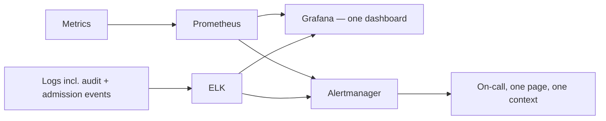

# The stack that tells you something's wrong before a customer does

**Onclusive — Senior DevSecOps Engineer, 2026**

## What the gates upstream can't catch

Between the pipeline gates in [`01-enterprise-cicd-platform`](../01-enterprise-cicd-platform) and
the admission/network controls in
[`03-kubernetes-workload-hardening`](../03-kubernetes-workload-hardening), a lot gets stopped
before it becomes a problem. None of it catches what only shows up at runtime: a slow memory leak
three days from an outage, a service suddenly eating auth failures at ten times its baseline rate,
a dependency degrading quietly under load nobody load-tested for. Those failure modes don't have a
gate you can put in front of them. The only defense is noticing fast enough to act before a
customer does.

## Building one system instead of two adjacent ones

The obvious approach is to build an operational monitoring stack, then separately bolt on security
alerting once someone asks for it. I built it as one system from the start, and the reason is
practical rather than philosophical: Prometheus handles metrics, ELK centralizes logs — including
Kubernetes audit logs and the admission-controller denial events coming out of
[`03-kubernetes-workload-hardening`](../03-kubernetes-workload-hardening) — and both feed one
Grafana view. The log-shipping configuration (`scripts/filebeat.yaml`) tags security-relevant
sources separately at ingest, and the alerting rules (`scripts/prometheus-alerts.yaml`) treat
"auth-failure rate is ten times normal" with the same operational urgency as "error rate crossed
2%." An on-call engineer investigating an incident at 2am doesn't context-switch between an
ops dashboard and a security dashboard to figure out if what they're looking at is a bug or an
attack — often, in the early minutes, you genuinely can't tell which it is, and the correlation
has to already exist for you to find out quickly.

## The tuning problem I underestimated

The security-relevant alerts were noisy for roughly the first two to three weeks after I turned
them on — the same underlying failure mode as the unfiltered scanner findings in
[`02-devsecops-shift-left`](../02-devsecops-shift-left): an alert that fires on things that turn
out to be nothing gets muted, and a muted alert is strictly worse than no alert, because it creates
false confidence that someone's watching. I deliberately delayed turning on paging until I'd
tuned every threshold against several weeks of real baseline traffic, which meant the stack sat in
observe-only mode longer than I'd initially planned for. That delay was the right call — an
alerting system people trust from week one is worth more than one that's technically complete two
weeks earlier and gets ignored.

## Where this actually shows up

**99.9%** platform uptime, held steady, with detection that's proactive by design rather than
"we heard about it from a customer complaint." The value of this stack was never the dashboards
themselves — it's the minutes it saves between something going wrong and someone qualified
noticing, which on a platform at this scale is usually the difference between a quiet fix and a
real incident.
