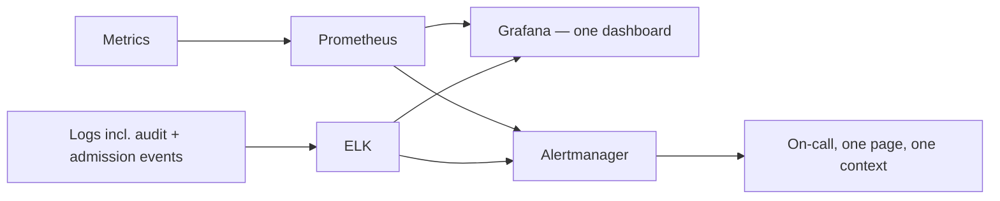

# The stack that tells you something's wrong before a customer does

**Onclusive — Senior DevSecOps Engineer, 2026**

Gates at merge time and admission time catch a lot. They don't catch a slow memory leak heading
toward an outage, or a service suddenly eating auth failures at ten times its normal rate. Those
only show up once something is actually running — which means the question isn't "did we block the
bad thing," it's "will we notice in time."

## What I put together

Prometheus for metrics, ELK for logs, both feeding Grafana so an on-call engineer isn't
context-switching between three tools mid-incident. The part that made this more than a standard
observability stack was tagging security-relevant sources — auth failures, admission-controller
rejections from [`03-kubernetes-workload-hardening`](../03-kubernetes-workload-hardening),
network-policy drops — separately in the log pipeline (`scripts/filebeat.yaml`), and writing
alert rules (`scripts/prometheus-alerts.yaml`) that treat "ten times the normal auth-failure rate"
with the same urgency as "error rate above 2%." Most teams monitor for outages and bolt security
alerting on as an afterthought. I built it as one system from the start, because by the time
you're correlating an audit log against a metrics dashboard by hand during an actual incident, you
already lost the time that mattered.

## A real tuning problem worth mentioning

The security alerts were noisy the first couple of weeks — same failure mode as the scanner
findings in [`02-devsecops-shift-left`](../02-devsecops-shift-left): an alert nobody trusts gets
muted, and a muted alert is worse than no alert because it creates false confidence someone's
watching. I spent real time tuning thresholds against actual baseline traffic before turning on
paging, which delayed "done" by a couple of weeks and was worth every day of it.

## Result

**99.9%** platform uptime, held steady, with detection that's proactive rather than
"we found out when someone complained." That's the actual point of this stack — not a dashboard
that looks impressive, one that gets someone to the right answer before it's a bigger problem.
