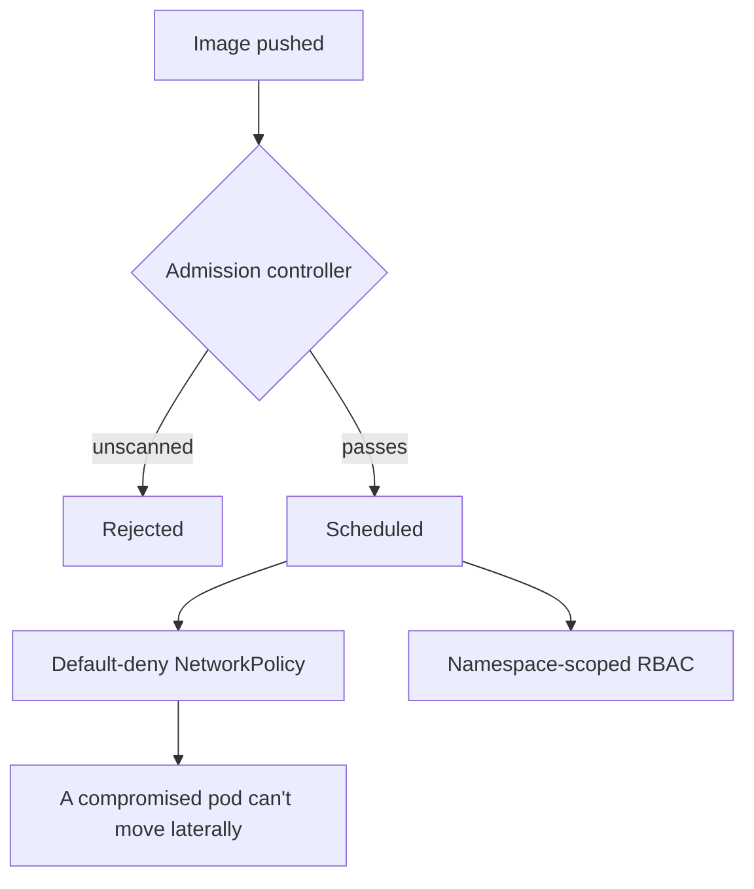

# A clean pipeline tells you nothing about what happens after deploy

**Onclusive — Senior DevSecOps Engineer, 2026**
*(runtime security for the platform in [`01-enterprise-cicd-platform`](../01-enterprise-cicd-platform))*

## What a passing pipeline doesn't guarantee

An image that clears every gate in the CI/CD platform is a scanned, tested image. It says nothing
about what that container is allowed to do once it's actually scheduled onto a cluster running
mission-critical production workloads — and when I looked at the runtime side of this platform,
the answer was: almost anything. Any pod could reach any other pod on the network by default.
Service accounts routinely had more privilege than the workload attached to them actually used,
because "give it enough permission that it definitely works" is the path of least resistance when
nobody's enforcing otherwise. And there was nothing at the cluster boundary checking that a
deployed image had actually been through the scanning pipeline at all — if a deploy manifest ever
bypassed CI, for any reason, the cluster would run it without complaint.

That last gap is the one that actually worried me. A pipeline gate only protects you if every path
to production goes through the pipeline, and I don't like betting security posture on "every path
always does."

## Three layers, each closing a different failure mode

**Admission control that checks provenance, not just intent.** I wrote an OPA Gatekeeper policy
(`scripts/gatekeeper-constraint.yaml`) that rejects any deployment referencing an image outside
the approved, scanned registry — enforced by the cluster itself. This is the layer that makes the
CI/CD gates actually mean something: even if a manifest somehow bypassed the pipeline, the cluster
independently refuses to run it.

**Default-deny networking, rolled out carefully.** Every namespace now starts with a deny-all
`NetworkPolicy` (`scripts/network-policy.yaml`), with explicit allow rules added per service for
exactly the traffic it needs. I'll be honest about how this actually went: my first attempt was to
apply default-deny cluster-wide in one pass, and it broke legitimate traffic I hadn't fully
mapped — some services talked to dependencies I didn't know about until they stopped working. I
backed that out, went namespace by namespace instead, ran each one in monitor-only mode for a few
days to see what traffic actually existed before switching to enforce, and only then moved to the
next namespace. Slower, and it's the only way I'd trust this kind of change on a production
financial-adjacent system.

**RBAC scoped to the job, not the convenience.** No service account for an application workload
gets cluster-admin, ever (`scripts/rbac.yaml`) — each one gets exactly the verbs on exactly the
resources it uses, which sounds obvious until you look at how many production clusters don't
actually enforce it.

## Why I don't accept "our pipeline is secure" as a complete answer

I've sat in enough conversations where "we scan everything in CI" was offered as the entire
security story for a platform, with runtime left as an implicit assumption rather than a designed
control. Pipeline security and runtime security fail differently — a pipeline gate stops a bad
artifact from being built; a runtime control stops a workload, however it got there, from doing
more damage than its job requires. Treating them as the same conversation is how a team ends up
with real coverage on paper and a real gap in practice. I'd rather carry both layers and never
need the second one than find out the hard way it was missing.

## What this bought the platform

This is a meaningful part of why the broader platform holds **99.9%** uptime and **45%** fewer
incidents: a workload that misbehaves — compromised, misconfigured, or just buggy — inside a
default-deny network with scoped RBAC can't turn into a platform-wide incident, because by design
it can't reach anything it wasn't explicitly allowed to reach.

*Detection layer: [`04-security-observability-stack`](../04-security-observability-stack) — how a
violation at this layer actually gets noticed.*
