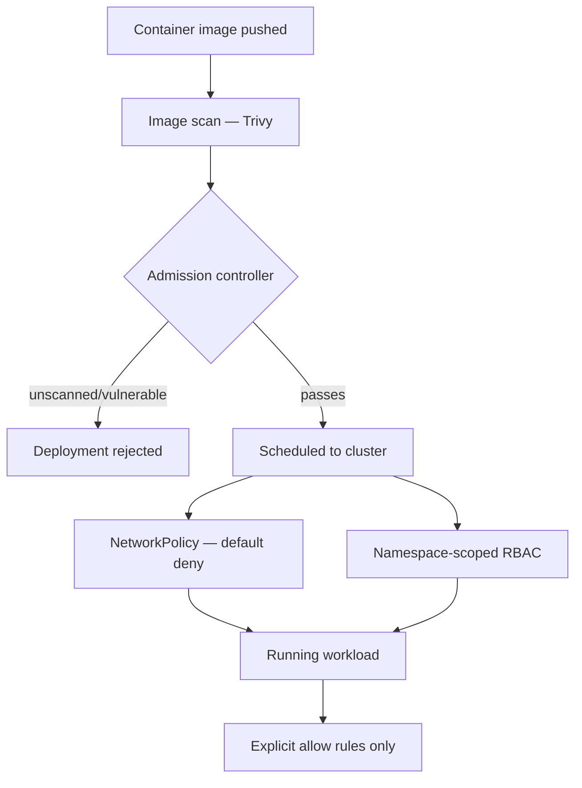

# Kubernetes Workload Security Hardening

**Employer:** Onclusive — Senior DevSecOps Engineer · **Timeframe:** 2026 · **Role:** Sole
platform security engineer · **Client:** withheld under NDA

> Re-cut of the platform in [`01-enterprise-cicd-platform`](../01-enterprise-cicd-platform),
> focused on runtime cluster security rather than the pipeline.

## Summary

Getting code through a secure pipeline doesn't secure what happens once a container is actually
running. This project hardened the cluster side: what a workload is allowed to do once deployed,
not just what's allowed to reach the cluster.

## The challenge

Mission-critical production workloads ran on Kubernetes without workload-level guardrails — any
pod could reach any other pod on the network, run with more privilege than it needed, and there
was no gate stopping an unscanned image from being deployed.

## Architecture

## Implementation

- **Admission control**: an admission-controller policy (`scripts/gatekeeper-constraint.yaml`,
  OPA Gatekeeper) rejects any deployment referencing an image that hasn't passed the Trivy scan
  gate — enforced at the cluster, not just hoped-for from the pipeline.
- **Network policy, default-deny**: every namespace starts with a deny-all `NetworkPolicy`
  (`scripts/network-policy.yaml`); services get explicit allow rules only for the traffic they
  actually need, not open-by-default.
- **RBAC scoped to namespace**: service accounts get the minimum verbs on the minimum resources
  they need (`scripts/rbac.yaml`) — no cluster-admin service accounts for application workloads.

## Security

This is defense in depth on top of the pipeline gates in
[`01-enterprise-cicd-platform`](../01-enterprise-cicd-platform)/[`02-devsecops-shift-left`](../02-devsecops-shift-left)
— even if something slipped past the pipeline, the cluster itself won't run an unscanned image,
and a compromised pod can't move laterally by default.

## Outcomes

- Mission-critical production workloads secured with image scanning, admission control, network
  policies, and RBAC (resume-stated scope of this work)
- Contributes to the platform's **99.9%** uptime and **−45%** production-incident figures
  reported for the broader CI/CD platform effort — a compromised or misbehaving workload
  contained by network policy doesn't become a wider incident

## Lessons

Default-deny `NetworkPolicy` broke more legitimate traffic on rollout than expected — the fix was
staging it namespace-by-namespace with a monitoring period before enforcing, not flipping it
cluster-wide on day one.

## Tech stack

Kubernetes, OpenShift, Helm, OPA Gatekeeper, Trivy, RBAC, NetworkPolicy

## Related

- [`01-enterprise-cicd-platform`](../01-enterprise-cicd-platform) — the pipeline these images come from
- [`04-security-observability-stack`](../04-security-observability-stack) — how violations and incidents get detected
