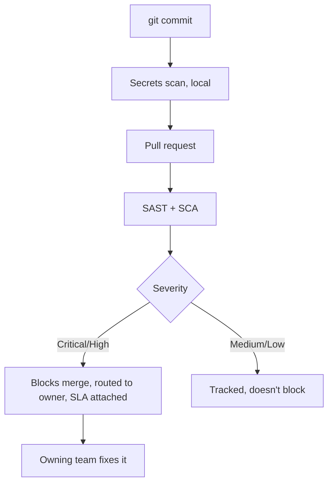

# Getting teams to actually fix what the scanners find

**Onclusive — Senior DevSecOps Engineer, 2026**
*(the security program built on top of the platform in [`01-enterprise-cicd-platform`](../01-enterprise-cicd-platform))*

Here's a thing nobody tells you when they sell you a security scanner: turning it on is the easy
part. The hard part is that a scanner producing findings nobody acts on is worse than not having
one — it trains engineers to click past red X's, and eventually they stop reading them at all.

That was the actual problem I was solving. Not "we need more scanning." We had scanning. What we
didn't have was a reason for anyone to trust it.

## What I built instead of more rules

A secrets-scanning pre-commit hook, so a credential never gets a chance to sit in git history in
the first place — cheaper to catch at a developer's laptop than in a CI log six people already
saw. A severity threshold that only blocks a merge for Critical/High and just tracks Medium/Low —
because a gate that blocks on everything teaches people to find workarounds, and a gate that
blocks on the right things teaches people to trust it. And a lightweight threat-modeling template
(`scripts/threat-model-template.md`) for anything architecturally significant — new service
boundary, new external integration — built to take thirty minutes with the owning team, not to
become a document that never gets finished.

## Why this is a management problem, not a tooling one

I've watched security programs fail for the same reason twice now — someone picks the strictest
possible policy, teams route around it within a month, and six months later there's a "security
theater" reputation that takes years to undo. The fix isn't a better scanner. It's designing the
threshold and the ownership model so the easiest path for an engineer is also the compliant one.
That's the actual DevSecOps job, and it's mostly a people-and-incentives problem wearing a
technical costume.

## What it did for the numbers

This program runs inside the same pipeline as the platform work, so the headline numbers are
shared: **60%** more deploys, **45%** fewer production incidents — both while enforcing the policy
at every stage rather than relaxing it to hit velocity targets. Those two moving in the same
direction at once is the actual proof the design worked, because they usually fight each other.

*Runtime counterpart: [`03-kubernetes-workload-hardening`](../03-kubernetes-workload-hardening) —
what happens if something does slip past all of this.*
