# zero-trust-gitops-platform

A production-grade reference implementation of GitOps delivery on AWS EKS with zero long-lived
credentials, cryptographically attested images, and policy-enforced admission.

[](https://github.com/beniaXcode/yahia-benabbou-portfolio/actions/workflows/ci.yml)
[](https://github.com/beniaXcode/yahia-benabbou-portfolio/actions/workflows/e2e-kind.yml)
[](../LICENSE)

> **How does code reach production without anyone holding a permanent key?**
>
> Every credential here is minted for one operation and expires in minutes — not issued once and
> reused. The cluster re-verifies cryptographic build identity at admission — it never simply
> trusts that CI did its job. Read on for exactly how.

## The headline claims

Each one is checkable directly against this repository, not asserted:

- **`0`** GitHub Actions secrets in this repository — enforced by
  [`tools/check-no-secrets.sh`](tools/check-no-secrets.sh) and
  [`.github/workflows/verify-no-secrets.yml`](../.github/workflows/verify-no-secrets.yml) on every
  push.
- **`0`** long-lived AWS access keys anywhere in the system —
  [`infra/terraform/policy/`](infra/terraform/policy) denies any `aws_iam_access_key` resource at
  plan time, with a fail fixture proving the guard actually rejects one.
- **`0`** private signing keys — signing identity *is* the workflow itself, via Sigstore keyless
  ([ADR-0003](docs/adr/0003-sigstore-keyless-signing.md)).
- Every deployed image verified at admission against *who built it*, not merely that it's signed —
  [`policies/supply-chain/verify-image-signature.yaml`](policies/supply-chain/verify-image-signature.yaml).
- **6** attack scenarios, blocked and tested on every pull request —
  [`demo/attack/`](demo/attack), run by [`e2e-kind.yml`](../.github/workflows/e2e-kind.yml).

## The architecture



The full walkthrough, with a file link for every step, is in [`docs/architecture.md`](docs/architecture.md).

## Verify this yourself

Once a real image has been built and signed by this repository's own workflow (see
[`docs/fidelity.md`](docs/fidelity.md) for the current state of that pipeline), anyone can confirm
it independently — no access to this repository, AWS account, or Kubernetes cluster required:

```sh
cosign verify ghcr.io/beniaxcode/yahia-benabbou-portfolio/demo-api@<digest> \
  --certificate-identity-regexp "^https://github.com/beniaXcode/yahia-benabbou-portfolio/.github/workflows/build-sign-attest.yml@refs/heads/main$" \
  --certificate-oidc-issuer "https://token.actions.githubusercontent.com"
```

Expected output: `Verification for ghcr.io/beniaxcode/yahia-benabbou-portfolio/demo-api@<digest> --`
followed by the certificate's subject and issuer matching exactly what was passed in — proof that
*this exact workflow, on this exact ref*, produced the image, not merely that some signature
exists. `make verify-chain DIGEST=<digest>` wraps this plus the SLSA provenance check.

## Quickstart

```sh
git clone https://github.com/beniaXcode/yahia-benabbou-portfolio.git
cd yahia-benabbou-portfolio/zero-trust-gitops-platform
make demo         # kind + Calico + Argo CD + Kyverno + a signed demo-api, offline-capable
make demo-attack  # all six attack scenarios, each printing EXPECTED/ACTUAL
```

| Prerequisite | Why |
|---|---|
| Docker | `kind` runs the cluster as containers |
| `kind`, `kubectl`, `kustomize` | Already present on GitHub's own `ubuntu-latest` runners, at the exact versions this repo pins |
| `cosign` | Signs the locally-built image with a demo-only ephemeral key ([ADR-0006](docs/adr/0006-local-demo-fidelity-fallbacks.md)) |
| ~10 minutes, no AWS account | C10: this loop is entirely offline-capable |

`make demo` never talks to AWS: no account exists behind the local kind cluster, so signing and
secrets both use documented, clearly-marked local substitutes — see `docs/fidelity.md` for exactly
what that means for what you're seeing versus what a real EKS deployment does.

## How it works

1. A signed commit opens a PR; CI shift-left-checks the exact same Kyverno policies admission
   enforces ([`docs/supply-chain.md`](docs/supply-chain.md)).
2. Merging exchanges a GitHub OIDC token for a 15-minute AWS session — the only credential that
   ever crosses that boundary ([`docs/identity-model.md`](docs/identity-model.md)).
3. The image is built, SBOM'd, vulnerability-gated, signed keylessly, and attested with SLSA
   provenance — all logged to a public transparency log
   ([`docs/supply-chain.md`](docs/supply-chain.md)).
4. A promotion PR bumps one digest in one overlay; Argo CD pulls and applies it — the cluster is
   never exposed to CI ([`docs/architecture.md`](docs/architecture.md)).
5. Kyverno independently re-verifies signature, provenance, SBOM, registry, and pod hardening
   before admitting anything ([`docs/policy-catalog.md`](docs/policy-catalog.md)).
6. A scheduled job keeps re-checking already-running images; Argo CD keeps reverting drift
   ([`docs/threat-model.md`](docs/threat-model.md)).

## What this deliberately does not do

- **Single cloud.** AWS only — no multi-cloud abstraction layer, which would dilute every
  cloud-specific control this repo demonstrates (Pod Identity, IMDSv2 hop limits) into a lowest
  common denominator.
- **Public-good Sigstore instance**, not a private Fulcio/Rekor deployment — see
  [`docs/threat-model.md`](docs/threat-model.md#what-would-actually-break-this) for what that
  trusts and doesn't.
- **Demo scale.** `demo-api` is a deliberately small stand-in workload (under 100 lines); this is
  not a reference for running a large multi-service application.
- **No multi-tenancy model.** Namespace-per-environment, not namespace-per-tenant with the
  additional isolation that implies.
- **No production AWS account.** This specific deployment has never been `terraform apply`d — see
  [`docs/fidelity.md`](docs/fidelity.md) for exactly what that means for which claims are
  code-verified versus asserted from static analysis.
- **Falco/Tetragon runtime detection** is explicitly out of scope here — [ADR-0006](docs/adr/0006-local-demo-fidelity-fallbacks.md)
  records why, honestly, rather than shipping an untested Helm values file.

## Repository map

| Path | Purpose |
|---|---|
| `docs/` | Architecture, threat model, ADRs, runbooks, compliance mapping, the case study |
| `infra/terraform/` | AWS identity foundation: OIDC provider, EKS, ECR, Pod Identity, KMS, Secrets Manager |
| `policies/` | Kyverno policies — the single source of truth for both admission and shift-left CI checks |
| `gitops/` | Argo CD app-of-apps, platform components, and the demo app's Kustomize overlays |
| `apps/demo-api/` | The deliberately small sample workload |
| `demo/` | `kind` cluster bring-up and the six attack scenarios |
| `tools/` | Small scripts backing `make` targets (policy catalog generation, secret checks, diagram rendering) |
| `test/` | End-to-end and fixture-based tests |
| `.claude/` | Claude Code project configuration for working in this repo |

See [`CLAUDE.md`](CLAUDE.md) for the ten non-negotiable constraints (C1–C10) this repository is
judged against.

## Further reading

- [Architecture](docs/architecture.md) · [Identity model](docs/identity-model.md) ·
  [Supply chain](docs/supply-chain.md)
- [Threat model](docs/threat-model.md) · [Compliance mapping](docs/compliance-mapping.md)
- [Architecture Decision Records](docs/adr/0001-ghcr-over-ecr-for-this-deployment.md) ·
  [Runbooks](docs/runbooks/policy-violation-triage.md)
- [Fidelity notes](docs/fidelity.md) — what this specific build environment could and couldn't
  verify for real, phase by phase, stated plainly rather than glossed over
- The case study on [`profile.nearvic.com`](https://profile.nearvic.com)

---

**Yahia Benabbou** — [nearvic.com](https://nearvic.com) ·
[profile.nearvic.com](https://profile.nearvic.com) · [GitHub](https://github.com/beniaXcode)
