# Architecture

## The question this repository answers

*How does code reach production without anyone holding a permanent key?*

Every credential in this system is minted for one operation and expires in minutes. Every
artifact is re-verified by the thing running it, not trusted because CI said so. Those two
properties — **no standing privilege** and **no implicit trust in the artifact** — are what make
this "zero-trust" rather than "well-configured."

## The trust chain, end to end

Source: [`diagrams/src/trust-chain.mmd`](diagrams/src/trust-chain.mmd), rendered by
[`tools/render-diagrams.sh`](https://github.com/beniaXcode/yahia-benabbou-portfolio/blob/main/zero-trust-gitops-platform/tools/render-diagrams.sh) via mermaid-cli (pinned version in
[`versions.md`](versions.md)).

1. A developer pushes a signed commit. A pull request runs CI: Go lint/vet/test, `terraform
   validate`/`tflint`/`checkov`, `kyverno test`, gitleaks, and a shift-left `kustomize build |
   kyverno apply` against every `gitops/apps/*/overlays/*` — the same policies enforced at
   admission, checked before merge (C8). The branch ruleset (Phase 9) requires all of it plus
   CODEOWNERS review and signed commits before merge.
2. On merge, [`.github/workflows/build-sign-attest.yml`](https://github.com/beniaXcode/yahia-benabbou-portfolio/blob/main/.github/workflows/build-sign-attest.yml)
   requests a GitHub OIDC token (`id-token: write`) and exchanges it with AWS STS
   (`AssumeRoleWithWebIdentity`) for a 15-minute session. See [`identity-model.md`](identity-model.md)
   for exactly what that token can and cannot do.
3. The workflow builds `apps/demo-api` (digest-pinned base images, non-root, distroless — see
   [`apps/demo-api/Dockerfile`](https://github.com/beniaXcode/yahia-benabbou-portfolio/blob/main/zero-trust-gitops-platform/apps/demo-api/Dockerfile)), generates an SBOM with syft (SPDX
   and CycloneDX), and gates on grype (fails on CRITICAL, or HIGH with an available fix).
4. It signs the image **keylessly** with cosign: the same OIDC token used for AWS is exchanged
   with Fulcio for a short-lived signing certificate, so the signature's identity *is* the
   workflow — there is no private key to steal, rotate, or leak (see [`supply-chain.md`](supply-chain.md)
   and [ADR-0003](adr/0003-sigstore-keyless-signing.md)). It attests the SBOM and a SLSA Build L3
   provenance statement the same way. Every signature and attestation is logged to Rekor, a public
   transparency log — anyone can look up what was signed and when, independent of this repository.
5. A promotion workflow opens a pull request that bumps the image digest in
   `gitops/apps/demo-api/overlays/<env>/kustomization.yaml` — nothing else. Merging that PR is the
   only way an image reaches an environment.
6. Argo CD — which polls this repository; the repository never has credentials to reach the
   cluster — applies the resulting manifests. `selfHeal: true` and `prune: true` on every
   Application mean the cluster's live state can never permanently diverge from what's committed
   (exercised for real in [`demo/attack/05-out-of-band-drift.sh`](https://github.com/beniaXcode/yahia-benabbou-portfolio/blob/main/zero-trust-gitops-platform/demo/attack/05-out-of-band-drift.sh)).
7. Kyverno's admission controller re-verifies the image's signature, its SLSA provenance, its SBOM
   attestation, its registry, and that it's referenced by digest — independent of anything Argo CD
   or CI decided — before it applies pod-hardening checks (non-root, read-only root filesystem, no
   privilege escalation, dropped capabilities, seccomp, no host namespaces/hostPath/privileged,
   resource limits, required labels) and generates a default-deny `NetworkPolicy` and
   `ResourceQuota` for any namespace that doesn't have one. See
   [`policy-catalog.md`](policy-catalog.md) for the full, generated list.
8. The running workload gets its own AWS permissions via EKS Pod Identity — scoped to exactly what
   it needs, never inherited from the node — and its runtime secrets via External Secrets Operator
   reading AWS Secrets Manager. Nothing sensitive is ever committed to Git (C7).
9. Continuous verification keeps checking after deployment: Argo CD's drift detection, Policy
   Reporter's cluster-wide compliance view, and a scheduled CronJob
   ([`gitops/platform/verification/cronjob.yaml`](https://github.com/beniaXcode/yahia-benabbou-portfolio/blob/main/zero-trust-gitops-platform/gitops/platform/verification/cronjob.yaml))
   that re-runs `cosign verify` against every currently-running image digest.

## Trust boundaries

Source: [`diagrams/src/trust-boundaries.mmd`](diagrams/src/trust-boundaries.mmd).

| Boundary | What crosses it | What doesn't |
|---|---|---|
| Developer ↔ GitHub | A signed commit / pull request | Any credential with cluster or cloud access |
| GitHub Actions ↔ AWS | One short-lived OIDC-derived STS session, scoped to exactly one role | Any static `AWS_ACCESS_KEY_ID`/`AWS_SECRET_ACCESS_KEY` — there is none, anywhere, in this repository (C1, C2) |
| GitHub Actions ↔ Sigstore (Fulcio/Rekor) | The same OIDC token, exchanged for a signing certificate valid for minutes | A cosign private key — there is none to leak (C3) |
| Git repository ↔ Argo CD | Argo CD *pulls* from the repository on a schedule | Nothing — the cluster is never exposed to CI, and CI never holds cluster credentials |
| Argo CD ↔ Kubernetes API | Manifests to apply | Argo CD does not bypass admission; every apply is a normal, policy-checked API write |
| Admission controller ↔ workload | Only a Pod whose image identity, provenance, and spec pass every policy | An unsigned, wrongly-signed, mutable-tagged, or hardening-violating Pod (demonstrated for real in `demo/attack/`) |
| Workload ↔ AWS | One Pod-Identity-scoped session per workload that has one at all | Node-role credentials, or any other workload's permissions |

## What this repository does not do

See the README's "What this deliberately does not do" section for the full, honest list
(single-cloud, public-good Sigstore instance, demo-scale kind cluster, no multi-tenancy). This
document assumes that context and does not repeat it.
